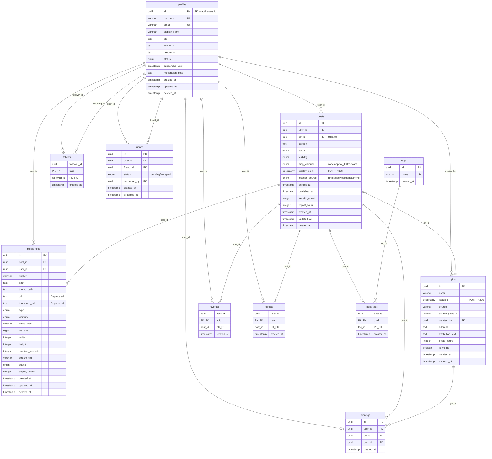

# ER図・データモデル設計

## 概要

RovRov SNSアプリケーションのデータモデル設計書です。最小構成として9つの主要エンティティを定義し、可視範囲・所有権・削除方針を明確にした設計としています。

**注**: 本設計ではSupabase Authの`auth.users`テーブルと連携する`profiles`テーブルを主体モデルとして使用します。
**タイムゾーン**: すべてのタイムスタンプはUTCで保持し、クライアント側でローカル時刻に変換します。

## 位置情報方針
- 投稿（Post）はPinが未設定でも作成可能
- 投稿は後からPinの追加・変更・削除が可能
- 地図に載せるか（&精度）は投稿ごとのユーザー設定で制御：
  - map_visibility: none（既定／地図に出さない）｜approx_100m（おおよそ100mで丸め）｜exact（正確）
- 地図に載せる座標はposts.display_point GEOGRAPHY(POINT,4326)に保持
- ベース座標の優先順位：Pin → EXIF/端末GPS → （なければ無し）
- map_visibilityに応じてdisplay_pointを生成／更新（noneならNULL）
- Pinは丸めない（施設は公知情報）。プライバシーは投稿側の地図表示設定で担保

## 主要エンティティ

### 1. profiles（プロファイル）
**説明**: ユーザープロファイル情報（auth.usersと1:1対応）

| 属性名 | 型 | 制約 | 説明 |
|--------|-----|------|------|
| id | UUID | PRIMARY KEY, FOREIGN KEY(auth.users.id) | ユーザーID（Supabase Auth UUID） |
| username | VARCHAR(50) | UNIQUE, NOT NULL | ユーザー名（一意識別子） |
| email | VARCHAR(255) | UNIQUE | メールアドレス |
| display_name | VARCHAR(100) | | 表示名 |
| bio | TEXT | | 自己紹介文 |
| avatar_url | TEXT | | プロフィール画像URL |
| header_url | TEXT | | ヘッダー画像URL |
| status | ENUM | NOT NULL, DEFAULT 'active' | アカウント状態（active/suspended/pending_deletion/deleted） |
| suspended_until | TIMESTAMP | | 一時停止の解除日時 |
| moderation_note | TEXT | | モデレーション理由・メモ |
| created_at | TIMESTAMP | NOT NULL | 作成日時 |
| updated_at | TIMESTAMP | NOT NULL | 更新日時 |
| deleted_at | TIMESTAMP | | 削除日時（論理削除） |

### 2. posts（投稿）
**説明**: ユーザーが作成する投稿データ

| 属性名 | 型 | 制約 | 説明 |
|--------|-----|------|------|
| id | UUID | PRIMARY KEY | 投稿ID |
| user_id | UUID | FOREIGN KEY(profiles.id) | 投稿者ID |
| pin_id | UUID | FOREIGN KEY(pins.id) | 場所タグID（nullable、後から変更可能） |
| caption | TEXT | | キャプション |
| status | ENUM | NOT NULL | 状態（draft/temporary/published/archived/deleted） |
| visibility | ENUM | NOT NULL, DEFAULT 'public' | 公開範囲（public/friends/private） |
| map_visibility | ENUM | NOT NULL, DEFAULT 'none' | 地図表示設定（none/approx_100m/exact） |
| display_point | GEOGRAPHY(POINT,4326) | | 地図表示座標（NULL=非表示） |
| location_source | ENUM | NOT NULL, DEFAULT 'none' | 座標出所（pin/exif/device/manual/none） |
| expires_at | TIMESTAMP | | 一時投稿の有効期限 |
| published_at | TIMESTAMP | | 公開日時（タイムライン並び替え用） |
| favorite_count | INTEGER | NOT NULL, DEFAULT 0 | いいね数（カウンタキャッシュ） |
| repost_count | INTEGER | NOT NULL, DEFAULT 0 | リポスト数（カウンタキャッシュ） |
| created_at | TIMESTAMP | NOT NULL | 作成日時 |
| updated_at | TIMESTAMP | NOT NULL | 更新日時 |
| deleted_at | TIMESTAMP | | 削除日時（論理削除） |

### 3. media_files（メディアファイル）
**説明**: 投稿に紐づく画像・動画ファイル

| 属性名 | 型 | 制約 | 説明 |
|--------|-----|------|------|
| id | UUID | PRIMARY KEY | メディアID |
| post_id | UUID | FOREIGN KEY(posts.id) ON DELETE CASCADE | 投稿ID |
| user_id | UUID | FOREIGN KEY(profiles.id) | 所有者ID |
| bucket | VARCHAR(255) | NOT NULL | ストレージバケット名 |
| path | TEXT | NOT NULL | ファイルパス |
| thumb_path | TEXT | | サムネイルパス |
| url | TEXT | | ファイルURL（Deprecated、互換性用） |
| thumbnail_url | TEXT | | サムネイルURL（Deprecated、互換性用） |
| type | ENUM | NOT NULL | ファイルタイプ（image/video） |
| visibility | ENUM | NOT NULL, DEFAULT 'inherit' | 公開範囲（inherit/public/friends/private） |
| mime_type | VARCHAR(100) | | MIMEタイプ |
| file_size | BIGINT | | ファイルサイズ（バイト） |
| width | INTEGER | | 幅（画像） |
| height | INTEGER | | 高さ（画像） |
| duration_seconds | INTEGER | | 長さ（動画、秒） |
| stream_uid | VARCHAR(255) | | Cloudflare Stream ID（動画） |
| status | ENUM | NOT NULL | 状態（uploading/processing/ready/failed/deleted） |
| display_order | INTEGER | NOT NULL, DEFAULT 0 | 表示順序 |
| created_at | TIMESTAMP | NOT NULL | 作成日時 |
| updated_at | TIMESTAMP | NOT NULL | 更新日時 |
| deleted_at | TIMESTAMP | | 削除日時（論理削除） |

### 4. follows（フォロー関係）
**説明**: ユーザー間のフォロー関係

| 属性名 | 型 | 制約 | 説明 |
|--------|-----|------|------|
| follower_id | UUID | FOREIGN KEY(profiles.id) ON DELETE CASCADE | フォロワーID |
| following_id | UUID | FOREIGN KEY(profiles.id) ON DELETE CASCADE | フォロー対象ID |
| created_at | TIMESTAMP | NOT NULL | フォロー開始日時 |

**主キー**: (follower_id, following_id) - 複合主キー

### 5. friends（友達関係）
**説明**: 相互承認による友達関係（双方向レコード）

| 属性名 | 型 | 制約 | 説明 |
|--------|-----|------|------|
| id | UUID | PRIMARY KEY | 友達関係ID |
| user_id | UUID | FOREIGN KEY(profiles.id) ON DELETE CASCADE | ユーザーID |
| friend_id | UUID | FOREIGN KEY(profiles.id) ON DELETE CASCADE | 友達ID |
| status | ENUM | NOT NULL | 状態（pending/accepted） |
| requested_by | UUID | FOREIGN KEY(profiles.id) | 申請者ID |
| created_at | TIMESTAMP | NOT NULL | 申請日時 |
| accepted_at | TIMESTAMP | | 承認日時 |

**複合ユニーク制約**: (user_id, friend_id)

### 6. pins（場所タグ）
**説明**: 投稿に紐づく場所情報

| 属性名 | 型 | 制約 | 説明 |
|--------|-----|------|------|
| id | UUID | PRIMARY KEY | Pin ID |
| name | VARCHAR(255) | NOT NULL | 場所名 |
| location | GEOGRAPHY(POINT, 4326) | NOT NULL | 正確座標（丸めない） |
| source | VARCHAR(50) | NOT NULL, DEFAULT 'user' | データソース（user/google/foursquare等） |
| source_place_id | VARCHAR(255) | | 外部プロバイダID |
| created_by | UUID | FOREIGN KEY(profiles.id) ON DELETE SET NULL | 作成者ID |
| address | TEXT | | 住所（キャッシュ） |
| attribution_text | TEXT | | 出典表示テキスト |
| posts_count | INTEGER | NOT NULL, DEFAULT 0 | 投稿数（カウンタキャッシュ） |
| is_visible | BOOLEAN | NOT NULL, DEFAULT true | 表示フラグ |
| created_at | TIMESTAMP | NOT NULL | 作成日時 |
| updated_at | TIMESTAMP | NOT NULL | 更新日時 |

**インデックス**: 
- INDEX on location USING GIST
- INDEX on source_place_id

### 7. favorites（いいね）
**説明**: ユーザーが投稿にいいねを付ける

| 属性名 | 型 | 制約 | 説明 |
|--------|-----|------|------|
| user_id | UUID | FOREIGN KEY(profiles.id) ON DELETE CASCADE | ユーザーID |
| post_id | UUID | FOREIGN KEY(posts.id) ON DELETE CASCADE | 投稿ID |
| created_at | TIMESTAMP | NOT NULL | いいね日時 |

**主キー**: (user_id, post_id) - 複合主キー

### 8. reposts（リポスト）
**説明**: ユーザーが投稿をリポスト/共有

| 属性名 | 型 | 制約 | 説明 |
|--------|-----|------|------|
| user_id | UUID | FOREIGN KEY(profiles.id) ON DELETE CASCADE | ユーザーID |
| post_id | UUID | FOREIGN KEY(posts.id) ON DELETE CASCADE | 投稿ID |
| created_at | TIMESTAMP | NOT NULL | リポスト日時 |

**主キー**: (user_id, post_id) - 複合主キー

### 9. pinnings（ブックマーク）
**説明**: ユーザーが保存した場所・投稿

| 属性名 | 型 | 制約 | 説明 |
|--------|-----|------|------|
| id | UUID | PRIMARY KEY | ブックマークID |
| user_id | UUID | FOREIGN KEY(profiles.id) ON DELETE CASCADE | ユーザーID |
| pin_id | UUID | FOREIGN KEY(pins.id) ON DELETE CASCADE | Pin ID（nullable） |
| post_id | UUID | FOREIGN KEY(posts.id) ON DELETE CASCADE | 投稿ID（nullable） |
| created_at | TIMESTAMP | NOT NULL | ブックマーク日時 |

**複合ユニーク制約**: 
- (user_id, pin_id) WHERE pin_id IS NOT NULL
- (user_id, post_id) WHERE post_id IS NOT NULL

### 10. tags（タグ）
**説明**: 投稿に付与されるタグ情報

| 属性名 | 型 | 制約 | 説明 |
|--------|-----|------|------|
| id | UUID | PRIMARY KEY | タグID |
| name | VARCHAR(64) | UNIQUE, NOT NULL | タグ名 |
| created_at | TIMESTAMP | NOT NULL | 作成日時 |

### 11. post_tags（投稿-タグ関係）
**説明**: 投稿とタグの多対多関係

| 属性名 | 型 | 制約 | 説明 |
|--------|-----|------|------|
| post_id | UUID | FOREIGN KEY(posts.id) ON DELETE CASCADE | 投稿ID |
| tag_id | UUID | FOREIGN KEY(tags.id) ON DELETE CASCADE | タグID |
| created_at | TIMESTAMP | NOT NULL | 関連付け日時 |

**主キー**: (post_id, tag_id) - 複合主キー

## エンティティ関係図



## 関係の詳細

### 1対多関係

1. **profiles → posts**: 1人のユーザーが複数の投稿を作成
   - 参照整合性: ON DELETE CASCADE（ユーザー削除時は投稿も連鎖物理削除）
   - 削除方針: pending_deletion 満了（30日）時に投稿を物理削除（バッチ／連鎖）。申請～満了までは触らない（第三者不可視はRLSで担保）。

2. **posts → media_files**: 1つの投稿に複数のメディアファイル
   - 参照整合性: ON DELETE CASCADE
   - 削除方針: 投稿削除時、メディアも連動削除（30日後Storage物理削除）

3. **profiles → follows**: ユーザーは複数のフォロー関係を持つ
   - 参照整合性: ON DELETE CASCADE
   - 削除方針: ユーザー削除時、即座に物理削除

5. **posts → favorites/reposts**: 1つの投稿に複数のいいね/リポスト
   - 参照整合性: ON DELETE CASCADE
   - 削除方針: 投稿削除時、即座に物理削除

4. **pins → posts**: 1つのPinに複数の投稿が紐づく
   - 参照整合性: ON DELETE SET NULL
   - 削除方針: Pin削除時、投稿のpin_idをNULLに設定

### 多対多関係

1. **profiles ↔ profiles (friends)**: 友達関係（双方向レコード）
   - 承認時に双方向レコード自動生成
   - 削除時は双方向レコード同時削除

2. **profiles ↔ posts (favorites/reposts)**: いいね/リポスト関係
   - ユーザー削除時: CASCADE削除
   - 投稿削除時: CASCADE削除

3. **profiles ↔ pins (pinnings)**: ユーザーのPin/投稿ブックマーク
   - ユーザー削除時: CASCADE削除
   - Pin/投稿削除時: CASCADE削除

## 削除方針とデータ保持

### 削除方式マトリクス

| エンティティ | 削除方式 | 保持期間 | 復旧可能性 |
|------------|---------|---------|-----------|
| profiles | pending_deletion（30日保持、**匿名化なし**）→ deleted（即時物理削除） | 30日 | 30日以内復帰可能 |
| posts | （個別削除）論理→30日後に物理削除 ／（アカウント削除）**pending_deletion 満了時（＝30日経過時）に物理削除** | 個別: 30日 / アカウント: 30日 | 個別: 災害復旧のみ / アカウント: 不可 |
| media_files | （個別削除）論理→30日後に物理削除 ／（アカウント削除）**pending_deletion 満了時（＝30日経過時）に物理削除** | 個別: 30日 / アカウント: 30日 | 個別: 災害復旧のみ / アカウント: 不可 |
| follows | 即時物理削除 | - | 不可 |
| friends | 即時物理削除 | - | 不可 |
| favorites | 即時物理削除 | - | 不可 |
| reposts | 即時物理削除 | - | 不可 |
| pins | 参照カウント管理 | posts_count=0で非表示 | 新規投稿で復活 |
| pinnings | 即時物理削除 | - | 不可 |

### 削除時の処理フロー

1. **ユーザー退会時**
   - profiles: status='pending_deletion'、deleted_at=NOW()（30日間猶予期間）
   - posts: 触らない（30日間そのまま保持）
   - media_files: 触らない（30日間そのまま保持）
   - follows/friends: 触らない（30日間そのまま保持）
   - 30日経過後: 全て物理削除（posts/media_files/profiles/auth.users/Storage/Stream含む）

2. **投稿削除時**
   - posts: deleted_at設定、status='deleted'
   - media_files: CASCADE（deleted_at設定）
   - pins: posts_countデクリメント
   - pinnings: CASCADE削除

## 可視範囲と権限制御

### Visibility列の値

| 値 | 説明 | アクセス可能者 |
|-----|------|--------------|
| public | 全体公開 | すべてのユーザー（未認証含む） |
| friends | 友達限定 | owner + friends + admin |
| private | 非公開 | owner + admin |
| inherit | 親の設定を継承 | （media_filesのみ） |

### 権限制御の優先順位

1. **ブロック関係**: 最優先（blocks テーブル、別途実装）
2. **削除済み**: deleted_at != null は非公開
3. **期限切れ**: posts.expires_at < NOW() は archived
4. **visibility設定**: 指定された公開範囲を適用
5. **最小権限原則**: 競合時は最も制限的な条件を適用

### メディアファイルの可視性制約

- media_files.visibility は親投稿より広くできない（DBトリガで強制）
- 'inherit' の場合は posts.visibility を継承
- 実効可視性 = MIN(posts.visibility, media_files.visibility)

## インデックス設計

### 主要インデックス

```sql
-- 位置情報検索用
CREATE INDEX idx_pins_location ON pins USING GIST (location);

-- 外部プロバイダID検索用
CREATE INDEX idx_pins_source_place ON pins(source, source_place_id);

-- タイムライン取得用
CREATE INDEX idx_posts_user_created ON posts(user_id, created_at DESC);
CREATE INDEX idx_posts_status_visibility ON posts(status, visibility) WHERE deleted_at IS NULL;

-- 友達関係検索用
CREATE INDEX idx_friends_user_status ON friends(user_id, status);
CREATE INDEX idx_friends_friend_status ON friends(friend_id, status);

-- フォロー関係検索用
CREATE INDEX idx_follows_follower ON follows(follower_id);
CREATE INDEX idx_follows_following ON follows(following_id);

-- メディアファイル取得用
CREATE INDEX idx_media_post_order ON media_files(post_id, display_order);

-- いいね検索用
CREATE INDEX idx_favorites_user ON favorites(user_id);
CREATE INDEX idx_favorites_post ON favorites(post_id);

-- リポスト検索用
CREATE INDEX idx_reposts_user ON reposts(user_id);
CREATE INDEX idx_reposts_post ON reposts(post_id);

-- ブックマーク検索用
CREATE INDEX idx_pinnings_user_pin ON pinnings(user_id, pin_id) WHERE pin_id IS NOT NULL;
CREATE INDEX idx_pinnings_user_post ON pinnings(user_id, post_id) WHERE post_id IS NOT NULL;
```

## 共通語彙（API/DB統一）

### 主要用語

| 用語 | 説明 | 使用箇所 |
|------|------|---------|
| user_id | リソース所有者のユーザーID | posts, media_files |
| visibility | 公開範囲設定 | posts, media_files |
| status | エンティティの状態 | profiles, posts, media_files, friends |
| created_at | 作成日時 | 全エンティティ |
| updated_at | 更新日時 | 主要エンティティ |
| deleted_at | 論理削除日時 | profiles, posts, media_files |
| expires_at | 有効期限 | posts (temporary) |
| pin_id | 場所タグID | posts, pinnings |
| post_id | 投稿ID | media_files, pinnings |

### 状態値（ENUM）

**profiles.status**
- active: 通常状態
- suspended: 一時停止
- pending_deletion: 退会申請後30日間の猶予期間
- deleted: 削除済み

**posts.status**
- draft: 下書き
- temporary: 24時間限定公開
- published: 恒久公開
- archived: アーカイブ済み
- deleted: 削除済み

**media_files.status**
- uploading: アップロード中
- processing: 処理中
- ready: 利用可能
- failed: 処理失敗
- deleted: 削除済み

**friends.status**
- pending: 申請中
- accepted: 承認済み

## 実装上の注意事項

### トリガー実装必須項目

1. **media_visibility_constraint**: media_files.visibilityが親投稿より広くならないよう制約
2. **friends_mutual_record**: 友達承認時の双方向レコード自動生成
3. **posts_count_update**: 投稿作成/削除時のpins.posts_countの更新
4. **temporary_post_archive**: expires_at経過時のstatus自動更新
5. **favorite_count_update**: いいね作成/削除時のposts.favorite_countの更新
6. **repost_count_update**: リポスト作成/削除時のposts.repost_countの更新
7. **posts_display_point_updater**: map_visibility・pin_id・位置情報変更時のdisplay_point自動更新
8. **posts_published_at_setter**: draft → published/temporary遷移時のpublished_at自動設定
9. **friend_request_requires_mutual_follow**: friend申請INSERT時に相互followを検証

### RLSポリシー実装

```sql
-- モデレーション対応: posts読み取りポリシー
CREATE POLICY posts_select_policy ON posts
FOR SELECT USING (
  -- ブロック関係がある場合は即座に拒否（最優先）
  NOT EXISTS (
    SELECT 1 FROM blocks b
    WHERE (b.blocker_id = auth.uid() AND b.blocked_id = posts.user_id)
       OR (b.blocker_id = posts.user_id AND b.blocked_id = auth.uid())
  )
  AND posts.deleted_at IS NULL
  AND (
    posts.user_id = auth.uid()  -- オーナーは閲覧可（suspendedでも）
    OR (
      -- 非オーナー: 所有者が active のときだけ
      EXISTS (
        SELECT 1 FROM profiles pr
        WHERE pr.id = posts.user_id
          AND pr.status = 'active'
          AND pr.deleted_at IS NULL
      )
      AND posts.status <> 'deleted'
      AND (
        posts.visibility = 'public'
        OR (
          posts.visibility = 'friends'
          AND EXISTS (
            SELECT 1 FROM friends
            WHERE user_id = auth.uid()
              AND friend_id = posts.user_id
              AND status = 'accepted'
          )
        )
      )
    )
  )
);

-- blocksテーブル定義（別途実装）
CREATE TABLE blocks (
  blocker_id UUID REFERENCES profiles(id) ON DELETE CASCADE,
  blocked_id UUID REFERENCES profiles(id) ON DELETE CASCADE,
  created_at TIMESTAMPTZ DEFAULT NOW(),
  PRIMARY KEY (blocker_id, blocked_id)
);
```

## まとめ

このデータモデルは、RovRov SNSアプリのMVP要件を満たす最小構成として設計されています。11つの主要エンティティ（profiles, posts, media_files, follows, friends, favorites, reposts, pins, pinnings, tags, post_tags）とblocksテーブルで、ユーザー管理、投稿、メディア、ソーシャル関係、場所情報、タグ機能を効率的に管理し、明確な削除方針と権限制御により、安全で拡張可能なシステムを実現します。

## モデレーション機能のDDL追加

### ENUM/列追加（profiles）

```sql
DO $
BEGIN
  IF EXISTS (SELECT 1 FROM pg_type WHERE typname = 'profile_status') THEN
    ALTER TYPE profile_status ADD VALUE IF NOT EXISTS 'pending_deletion';
  ELSE
    CREATE TYPE profile_status AS ENUM ('active','suspended','pending_deletion','deleted');
  END IF;
END $;

ALTER TABLE profiles
  ADD COLUMN IF NOT EXISTS status profile_status NOT NULL DEFAULT 'active',
  ADD COLUMN IF NOT EXISTS suspended_until TIMESTAMPTZ,
  ADD COLUMN IF NOT EXISTS moderation_note TEXT;
```

### 公開プロフィールビューの再定義

```sql
-- 公開プロフィールビュー（pending_deletion は除外）
CREATE OR REPLACE VIEW public_profiles AS
SELECT id, username, display_name, avatar_url
FROM profiles
WHERE deleted_at IS NULL
  AND status IN ('active','suspended');  -- pending_deletion は第三者不可視
```

### 書き込み禁止（suspended/deleted）をDBで強制

```sql
-- 書き込み禁止（posts）
CREATE OR REPLACE FUNCTION forbid_writes_if_not_active_posts()
RETURNS TRIGGER AS $
BEGIN
  IF EXISTS (
    SELECT 1 FROM profiles pr
    WHERE pr.id = COALESCE(NEW.user_id, OLD.user_id)
      AND pr.status <> 'active'
  ) THEN
    RAISE EXCEPTION 'account is not active; writes are forbidden';
  END IF;
  RETURN NEW;
END $ LANGUAGE plpgsql;

DROP TRIGGER IF EXISTS trg_posts_forbid_writes ON posts;
CREATE TRIGGER trg_posts_forbid_writes
BEFORE INSERT OR UPDATE OR DELETE ON posts
FOR EACH ROW EXECUTE FUNCTION forbid_writes_if_not_active_posts();

-- 書き込み禁止（media_files も同様に）
CREATE OR REPLACE FUNCTION forbid_writes_if_not_active_media()
RETURNS TRIGGER AS $
DECLARE uid UUID;
BEGIN
  SELECT p.user_id INTO uid FROM posts p WHERE p.id = COALESCE(NEW.post_id, OLD.post_id);
  IF EXISTS (SELECT 1 FROM profiles pr WHERE pr.id = uid AND pr.status <> 'active') THEN
    RAISE EXCEPTION 'account is not active; writes are forbidden';
  END IF;
  RETURN NEW;
END $ LANGUAGE plpgsql;

DROP TRIGGER IF EXISTS trg_media_forbid_writes ON media_files;
CREATE TRIGGER trg_media_forbid_writes
BEFORE INSERT OR UPDATE OR DELETE ON media_files
FOR EACH ROW EXECUTE FUNCTION forbid_writes_if_not_active_media();
```

### 退会ワークフロー（新方針）

```sql
-- 退会申請：pending_deletion に遷移（post/mediaは触らない）
CREATE OR REPLACE FUNCTION request_account_deletion(p_user UUID)
RETURNS void AS $
BEGIN
  UPDATE profiles
    SET status = 'pending_deletion',
        deleted_at = NOW()
  WHERE id = p_user;
END;
$ LANGUAGE plpgsql;

-- 復帰：active に戻す（post/mediaは触らない）
CREATE OR REPLACE FUNCTION cancel_pending_deletion(p_user UUID)
RETURNS void AS $
BEGIN
  UPDATE profiles
    SET status = 'active',
        deleted_at = NULL
  WHERE id = p_user
    AND status = 'pending_deletion';
END;
$ LANGUAGE plpgsql;

-- 期限到来：完全削除（物理）
CREATE OR REPLACE FUNCTION purge_expired_deletions()
RETURNS integer AS $
DECLARE
  deleted_count int := 0;
BEGIN
  -- ここではDB側の物理削除のみ。Storage/Streamはアプリ層で同期実行
  WITH expired_profiles AS (
    SELECT id
    FROM profiles
    WHERE status = 'pending_deletion'
      AND deleted_at < NOW() - INTERVAL '30 days'
  ),
  deleted_media AS (
    DELETE FROM media_files
    WHERE post_id IN (SELECT id FROM posts WHERE user_id IN (SELECT id FROM expired_profiles))
    RETURNING 1
  ),
  deleted_posts AS (
    DELETE FROM posts
    WHERE user_id IN (SELECT id FROM expired_profiles)
    RETURNING 1
  ),
  deleted_profiles AS (
    DELETE FROM profiles
    WHERE id IN (SELECT id FROM expired_profiles)
    RETURNING 1
  )
  SELECT COUNT(*) INTO deleted_count FROM deleted_profiles;

  RETURN deleted_count;
END;
$ LANGUAGE plpgsql;

-- 30日経過した pending_deletion アカウントの完全削除
-- （上記 purge_expired_deletions() 関数を毎日実行）
SELECT purge_expired_deletions();
```

### DDLサンプル（追加分）

```sql
-- Favoritesテーブル
CREATE TABLE favorites (
  user_id UUID REFERENCES profiles(id) ON DELETE CASCADE,
  post_id UUID REFERENCES posts(id) ON DELETE CASCADE,
  created_at TIMESTAMPTZ DEFAULT NOW(),
  PRIMARY KEY (user_id, post_id)
);

-- Repostsテーブル
CREATE TABLE reposts (
  user_id UUID REFERENCES profiles(id) ON DELETE CASCADE,
  post_id UUID REFERENCES posts(id) ON DELETE CASCADE,
  created_at TIMESTAMPTZ DEFAULT NOW(),
  PRIMARY KEY (user_id, post_id)
);

-- Pinningsテーブル
CREATE TABLE pinnings (
  id UUID PRIMARY KEY DEFAULT gen_random_uuid(),
  user_id UUID REFERENCES profiles(id) ON DELETE CASCADE,
  pin_id UUID REFERENCES pins(id) ON DELETE CASCADE,
  post_id UUID REFERENCES posts(id) ON DELETE CASCADE,
  created_at TIMESTAMPTZ DEFAULT NOW(),
  CHECK ((pin_id IS NOT NULL) <> (post_id IS NOT NULL))
);

CREATE UNIQUE INDEX uq_pinnings_user_pin ON pinnings(user_id, pin_id) WHERE pin_id IS NOT NULL;
CREATE UNIQUE INDEX uq_pinnings_user_post ON pinnings(user_id, post_id) WHERE post_id IS NOT NULL;

-- Postsテーブルにカウンタカラム追加
ALTER TABLE posts 
  ADD COLUMN IF NOT EXISTS favorite_count INTEGER NOT NULL DEFAULT 0,
  ADD COLUMN IF NOT EXISTS repost_count INTEGER NOT NULL DEFAULT 0;

-- Media Files status列追加
ALTER TABLE media_files
  ADD COLUMN IF NOT EXISTS status TEXT CHECK (status IN ('uploading','processing','ready','failed','deleted')) DEFAULT 'uploading';
```

将来的な拡張（通知、メッセージング等）にも対応できる基盤となる設計です。

## DDL定義（タグ機能）

```sql
-- タグ本体
CREATE TABLE tags (
  id UUID PRIMARY KEY DEFAULT gen_random_uuid(),
  name VARCHAR(64) UNIQUE NOT NULL,
  created_at TIMESTAMPTZ DEFAULT NOW()
);

-- 投稿-タグ中間（多対多）
CREATE TABLE post_tags (
  post_id UUID REFERENCES posts(id) ON DELETE CASCADE,
  tag_id  UUID REFERENCES tags(id)  ON DELETE CASCADE,
  created_at TIMESTAMPTZ DEFAULT NOW(),
  PRIMARY KEY (post_id, tag_id)
);

CREATE INDEX idx_post_tags_tag ON post_tags(tag_id);
CREATE INDEX idx_post_tags_post ON post_tags(post_id);

-- RLSは posts に準拠（joinで自然に適用）
```

## DDL定義（位置情報関連）

```sql
-- ENUM型定義
DO $$ BEGIN
  IF NOT EXISTS (SELECT 1 FROM pg_type WHERE typname = 'map_visibility') THEN
    CREATE TYPE map_visibility AS ENUM ('none','approx_100m','exact');
  END IF;
  IF NOT EXISTS (SELECT 1 FROM pg_type WHERE typname = 'location_source') THEN
    CREATE TYPE location_source AS ENUM ('pin','exif','device','manual','none');
  END IF;
END $$;

-- posts テーブルへの列追加
ALTER TABLE posts
  ADD COLUMN IF NOT EXISTS map_visibility map_visibility NOT NULL DEFAULT 'none',
  ADD COLUMN IF NOT EXISTS display_point GEOGRAPHY(POINT,4326),
  ADD COLUMN IF NOT EXISTS location_source location_source NOT NULL DEFAULT 'none',
  ADD COLUMN IF NOT EXISTS published_at TIMESTAMPTZ;

CREATE INDEX IF NOT EXISTS idx_posts_display_point ON posts USING GIST (display_point);

-- タイムライン用インデックス
CREATE INDEX IF NOT EXISTS idx_posts_user_published_at
  ON posts(user_id, published_at DESC);

CREATE INDEX IF NOT EXISTS idx_posts_visibility_published_at
  ON posts(visibility, published_at DESC);

CREATE INDEX IF NOT EXISTS idx_posts_status_published_at
  ON posts(status, published_at DESC);

-- ベース座標選択関数
CREATE OR REPLACE FUNCTION pick_base_point(p_id UUID, p_pin UUID)
RETURNS GEOGRAPHY AS $$
DECLARE base GEOGRAPHY;
BEGIN
  IF p_pin IS NOT NULL THEN
    SELECT location INTO base FROM pins WHERE id = p_pin;
  END IF;
  IF base IS NULL THEN
    SELECT ST_SetSRID(ST_MakePoint(lng, lat),4326)::geography
      INTO base
      FROM post_geo_events
      WHERE post_id = p_id
      ORDER BY captured_at DESC LIMIT 1;
  END IF;
  RETURN base;
END;
$$ LANGUAGE plpgsql;

-- display_point 自動計算トリガ
CREATE OR REPLACE FUNCTION set_post_display_point()
RETURNS TRIGGER AS $$
DECLARE base GEOGRAPHY;
BEGIN
  base := pick_base_point(COALESCE(NEW.id, OLD.id), NEW.pin_id);

  -- 出所の判定
  IF NEW.pin_id IS NOT NULL THEN
    NEW.location_source := 'pin';
  ELSIF base IS NOT NULL AND NEW.location_source = 'none' THEN
    NEW.location_source := 'device';
  END IF;

  -- map_visibility に従い display_point を確定
  NEW.display_point := CASE
    WHEN NEW.map_visibility = 'none' OR base IS NULL THEN NULL
    WHEN NEW.map_visibility = 'exact' THEN base
    WHEN NEW.map_visibility = 'approx_100m' THEN (
      ST_Transform(
        ST_SnapToGrid(ST_Transform(base::geometry, 3857), 100, 100),
        4326
      )::geography
    )
  END;

  RETURN NEW;
END;
$$ LANGUAGE plpgsql;

DROP TRIGGER IF EXISTS trg_posts_display_point ON posts;
CREATE TRIGGER trg_posts_display_point
BEFORE INSERT OR UPDATE OF pin_id, map_visibility ON posts
FOR EACH ROW EXECUTE FUNCTION set_post_display_point();
```

## クエリ例

### 近傍の地図表示可能な投稿取得
```sql
-- 地図に出せる投稿のみ取得
SELECT p.id, p.caption, ST_Distance(p.display_point, :pt) AS dist_m
FROM posts p
WHERE p.display_point IS NOT NULL
  AND p.deleted_at IS NULL
  AND p.status NOT IN ('deleted','draft')
  AND ST_DWithin(p.display_point, :pt, :radius_m)
ORDER BY dist_m
LIMIT 50;
```

### Pin候補提示
```sql
-- 正確な座標でPin候補を検索
SELECT id, name, ST_Distance(location, :pt) AS dist_m
FROM pins
WHERE ST_DWithin(location, :pt, 500) -- 500m以内
  AND is_visible = true
ORDER BY dist_m
LIMIT 10;
```

### 地図表示設定の更新
```sql
-- 地図表示設定変更（display_pointはトリガで自動再計算）
UPDATE posts
SET map_visibility = 'approx_100m'
WHERE id = :post_id
  AND user_id = auth.uid();
```

### Pin追加/変更/削除
```sql
-- Pin追加/変更（display_pointはトリガで自動再計算）
UPDATE posts
SET pin_id = :new_pin_id  -- NULLで削除
WHERE id = :post_id
  AND user_id = auth.uid();
```

## pins.posts_count/is_visible維持トリガ

```sql
-- pins.posts_count / is_visible をズレなく維持する関数とトリガ
CREATE OR REPLACE FUNCTION recalc_pin_stats(p_id UUID)
RETURNS void AS $$
  UPDATE pins p SET
    posts_count = (
      SELECT COUNT(*) FROM posts po
      WHERE po.pin_id = p_id
        AND po.deleted_at IS NULL
        AND po.status <> 'deleted'
    ),
    is_visible = (
      SELECT COUNT(*) > 0 FROM posts po
      WHERE po.pin_id = p_id
        AND po.deleted_at IS NULL
        AND po.status <> 'deleted'
    )
  WHERE p.id = p_id;
$$ LANGUAGE sql;

CREATE OR REPLACE FUNCTION on_posts_affect_pin()
RETURNS TRIGGER AS $$
BEGIN
  IF TG_OP IN ('INSERT','UPDATE') AND NEW.pin_id IS NOT NULL THEN
    PERFORM recalc_pin_stats(NEW.pin_id);
  END IF;
  IF TG_OP IN ('UPDATE','DELETE') AND OLD.pin_id IS NOT NULL
     AND (NEW.pin_id IS DISTINCT FROM OLD.pin_id OR TG_OP = 'DELETE') THEN
    PERFORM recalc_pin_stats(OLD.pin_id);
  END IF;
  RETURN NEW;
END;
$$ LANGUAGE plpgsql;

DROP TRIGGER IF EXISTS trg_posts_affect_pin ON posts;
CREATE TRIGGER trg_posts_affect_pin
AFTER INSERT OR UPDATE OF pin_id, status, deleted_at OR DELETE ON posts
FOR EACH ROW EXECUTE FUNCTION on_posts_affect_pin();
```