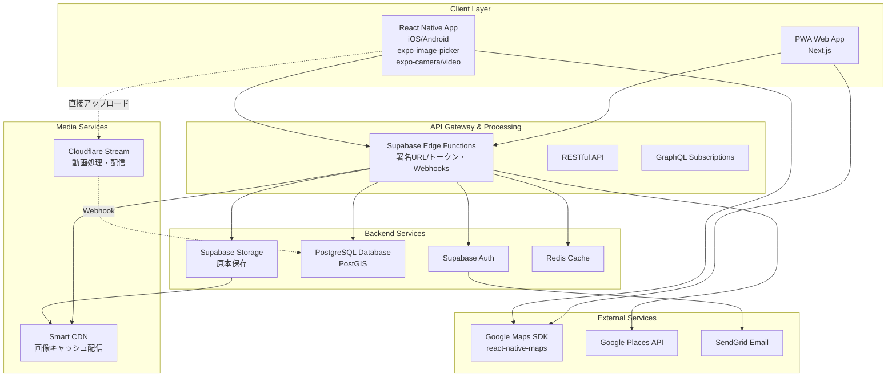
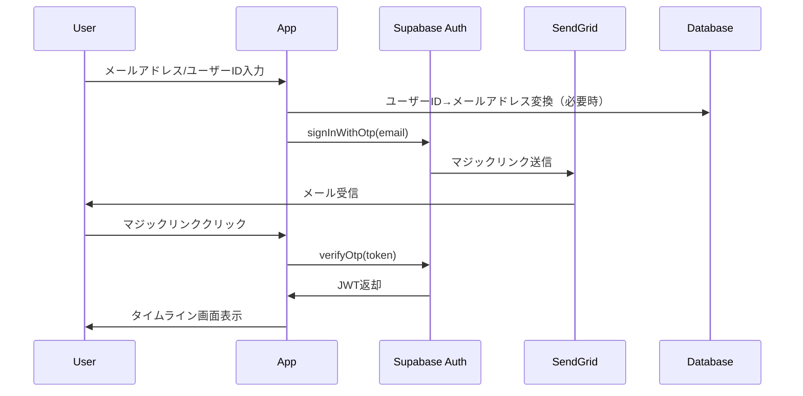
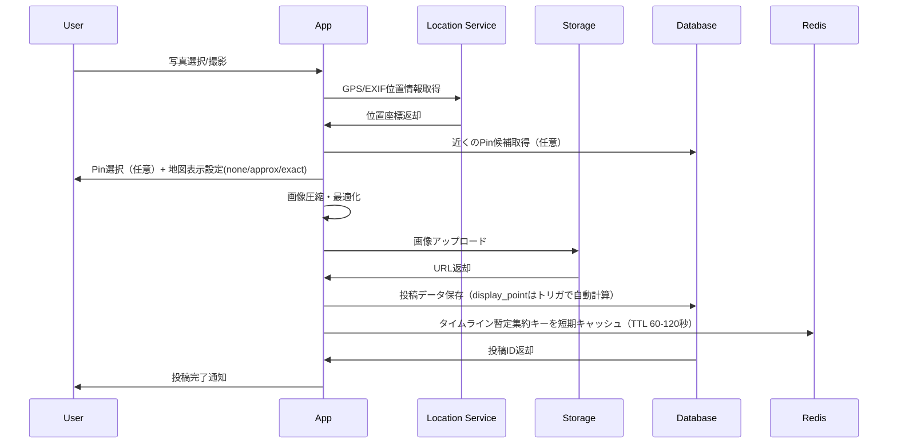
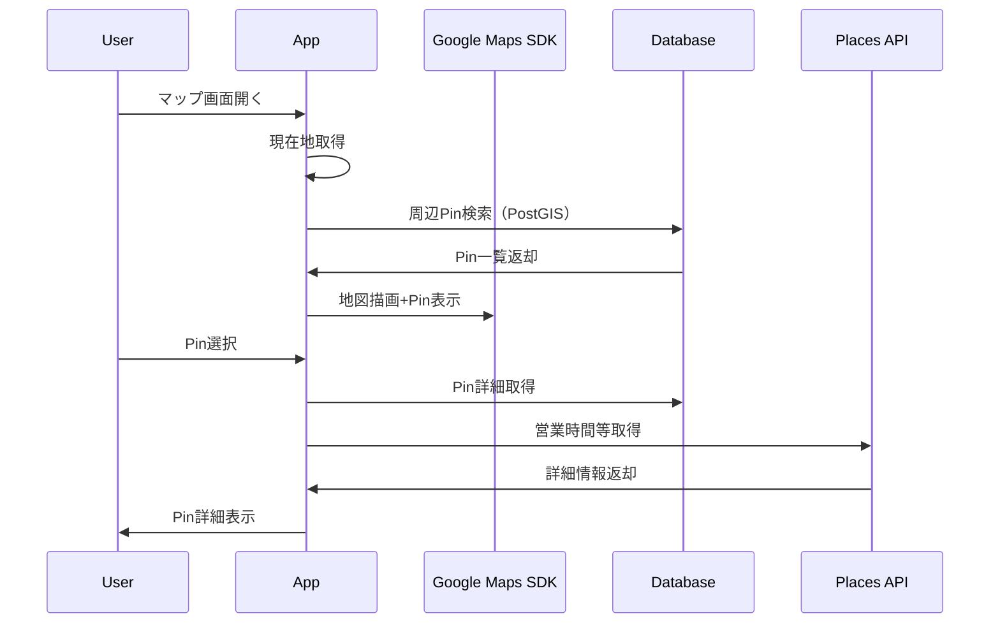
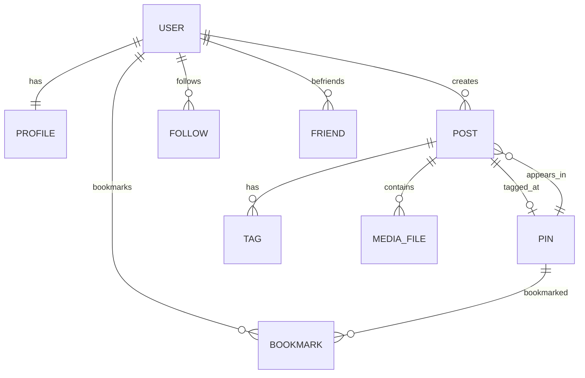
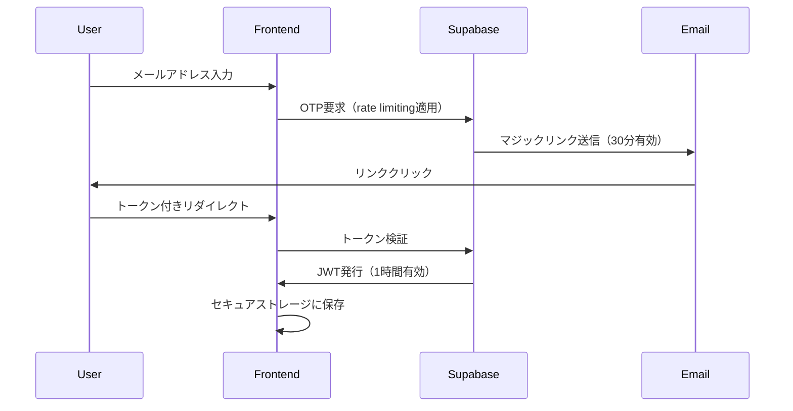
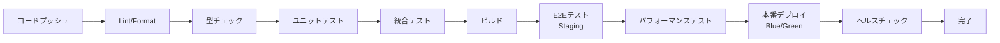

# 技術設計書

## 概要

RovRov SNSアプリは、位置情報ベースのソーシャルネットワーキングアプリケーションとして、React Native + Expoによるクロスプラットフォーム開発とSupabaseバックエンドを組み合わせた設計を採用します。本設計は、要件ドキュメントで定義された8つの主要機能要件と非機能要件を満たすことを目的としています。

### 位置情報方針
- 投稿（Post）はPinが未設定でも作成可能
- 投稿は後からPinの追加・変更・削除が可能
- 地図に載せるか（&精度）は投稿ごとのユーザー設定で制御：
  - map_visibility: none（既定／地図に出さない）｜approx_100m（おおよそ100mで丸め）｜exact（正確）
- 地図に載せる座標はposts.display_point GEOGRAPHY(POINT,4326)に保持
- ベース座標の優先順位：Pin → EXIF/端末GPS → （なければ無し）
- map_visibilityに応じてdisplay_pointを生成／更新（noneならNULL）
- Pinは丸めない（施設は公知情報）。プライバシーは投稿側の地図表示設定で担保

### キャッシュ戦略
キャッシュは L1/L3 を標準化し、L2（Redis/Upstash）はホットパス限定・短命（TTL必須）・SWR運用・PII禁止・障害時DBフォールバックの原則で運用する。

## 要件マッピング

### 設計コンポーネントのトレーサビリティ
各設計コンポーネントが対応する要件:

- **認証システム（Supabase Auth）** → 要件1: ユーザー認証とアカウント管理
- **投稿管理システム** → 要件2: 投稿機能（Post）
- **地図統合レイヤー** → 要件3: マップ機能（Rove）
- **タイムラインエンジン** → 要件4: タイムライン機能
- **ユーザープロファイルシステム** → 要件5: アカウント詳細画面
- **ソーシャルグラフ管理** → 要件6: ソーシャル機能
- **Pin管理システム** → 要件7: pin（場所タグ）管理
- **オフライン同期システム** → 要件8: データ永続性とパフォーマンス

### ユーザーストーリーカバレッジ
- **日常の記録**: 投稿機能とタイムライン機能で対応
- **場所の発見**: マップ機能とPin管理システムで実現
- **社会的つながり**: ソーシャル機能とプライバシー制御で実装

## アーキテクチャ

### システム全体構成



### 技術スタック

- **フロントエンド（モバイル）**: React Native + Expo + TypeScript
- **フロントエンド（Web）**: Next.js 14 + TypeScript + Tailwind CSS
- **状態管理**: Zustand + React Query
- **バックエンド**: Supabase (PostgreSQL + Edge Functions)
- **認証**: Supabase Auth (Magic Link)
- **画像処理**: Supabase Storage + Smart CDN + Image Transformations（オンザフライ最適化）
- **動画処理**: Cloudflare Stream (保管・トランスコード・配信)
- **地図**: react-native-maps (Google Maps SDK) + Google Places API + Cloud-based Maps Styling
- **キャッシュ**: 多層戦略（L1: React Query / L2: Redis/Upstash[段階的] / L3: Smart CDN / L4: Cloudflare Stream）
- **リアルタイム**: Supabase Realtime
- **メール配信**: SendGrid
- **監視**: Sentry + Vercel Analytics
- **テスト**: Jest + React Native Testing Library + Detox (E2E)
- **デプロイ**: Vercel (Web) + EAS Build (Mobile)

### アーキテクチャ決定の根拠

- **React Native選択理由**: 
  - iOS/Android両対応でコードベース統一
  - Expoによるネイティブ機能（カメラ、GPS、通知）の簡単な統合
  - コミュニティの成熟度と豊富なライブラリ

- **Supabase選択理由**:
  - マジックリンク認証のネイティブサポート
  - Row Level Security (RLS)による強力なデータ保護
  - Realtime と PostgreSQL の拡張性（PostGIS 等）
  - **Storage Image Transformations によるオンザフライ最適化（Edge Functions は署名URL/権限オーケストレーションに限定）**

- **画像処理戦略（確定）**:
  - 変換は **Supabase Storage Image Transformations** のみを使用（オンザフライ）
  - Edge Functions は **署名URL発行・権限前段のオーケストレーション** に限定
  - 生成URLは **短期署名 or パブリック変換**を使い分け（Privateは署名必須）
  - 形式自動選択: AVIF/WebP優先、JPEG フォールバック
  - EXIF除去: 位置情報等のメタデータ自動削除

- **動画処理戦略（Cloudflare Stream）**:
  - Direct Creator Upload: サーバー負荷ゼロのアップロード
  - 自動トランスコード: HLS/DASH + ABR配信
  - tus プロトコル: レジューム可能アップロード
  - Webhook統合: 処理完了時のリアルタイム通知
  - 署名トークン: 公開範囲制御

- **Google Maps SDK選択理由**:
  - react-native-maps: 実績豊富で安定したクロスプラットフォーム対応
  - Google Maps SDK: ネイティブパフォーマンス＋豊富な機能セット
  - Cloud-based Maps Styling: 再配布不要でUI配色・表示密度調整可能
  - コンプライアンス: Google利用規約に完全準拠（非Google地図との併用回避）

- **多層キャッシュ戦略**:
  - L1 (React Query): クライアントサイドの瞬間的再表示、0ms レイテンシ
  - L2 (Redis/Upstash): ホットパス専用、段階的導入でコスト最適化
  - L3 (Smart CDN): メディア配信の広域最適化
  - L4 (Cloudflare Stream): 動画配信専用の自動最適化
  - MVP期: Redis 不要でシンプル構成、成長に応じて段階的拡張

## データフロー

### 主要ユーザーフロー

#### 1. マジックリンク認証フロー


#### 2. 投稿作成フロー


#### 3. マップ探索フロー


## コンポーネントと インターフェース

### バックエンドサービスとメソッドシグネチャ

#### AuthService (TypeScript/Edge Functions)
```typescript
class AuthService {
  async sendMagicLink(email: string): Promise<void>                    // マジックリンク送信
  async verifyMagicLink(token: string): Promise<Session>              // トークン検証
  async getUserByUsername(username: string): Promise<User | null>     // ユーザー名検索
  async createProfile(userId: string, data: ProfileData): Promise<Profile>  // プロファイル作成
  async updateProfile(userId: string, data: Partial<ProfileData>): Promise<Profile>  // プロファイル更新
}
```

#### PostService
```typescript
class PostService {
  async createPost(data: PostData, userId: string): Promise<Post>     // 投稿作成（status='draft'または'temporary'）
  async updatePostStatus(postId: string, status: PostStatus): Promise<void>  // 状態遷移
  async schedulePostReview(postId: string): Promise<void>             // 24時間レビュー設定
  async convertToArchive(postId: string): Promise<void>               // status='archived'に変更
  async updateVisibility(postId: string, visibility: Visibility): Promise<void>  // 公開範囲変更
  async deletePost(postId: string, userId: string): Promise<void>     // 論理削除（deleted_at設定）
  async purgeDeletedPosts(): Promise<number>                          // 30日経過した投稿の物理削除
  async updateMapVisibility(postId: string, v: 'none'|'approx_100m'|'exact'): Promise<void>  // 地図表示設定変更
  async attachPin(postId: string, pinId: string | null): Promise<void>  // Pin変更/削除(null)
  async validateRepostVisibility(postId: string): Promise<boolean>      // リポスト前のpublic範囲チェック
}
```

#### LocationService
```typescript
class LocationService {
  async createPin(data: PinData): Promise<Pin>                        // Pin作成
  async searchPins(query: string, location?: Coordinates): Promise<Pin[]>  // Pin検索
  async getNearbyPins(location: Coordinates, radius: number): Promise<Pin[]>  // 周辺Pin取得
  async getPinDetails(pinId: string): Promise<PinDetail>              // Pin詳細取得
  async bookmarkPin(pinId: string, userId: string): Promise<void>     // Pinブックマーク
}
```

#### TimelineService
```typescript
class TimelineService {
  async getFeaturedFeed(page: number): Promise<Feed[]>                // 急上昇フィード
  async getFollowFeed(userId: string, page: number): Promise<Feed[]>  // フォロー中ユーザーのフィード
  async getFriendsFeed(userId: string, page: number): Promise<Feed[]>    // 友達フィード（followersは除外）
  async aggregateDailyPosts(userId: string, date: Date): Promise<DailyFeed>  // 日別集約
  async archiveExpiredPosts(): Promise<number>                        // 期限切れtemporary投稿のarchive化
}
```

#### SocialService
```typescript
class SocialService {
  async followUser(followerId: string, followingId: string): Promise<void>  // フォロー
  async unfollowUser(followerId: string, followingId: string): Promise<void>  // アンフォロー
  async sendFriendRequest(userId: string, friendId: string): Promise<void>  // 友達申請（相互フォロー必須）
  async acceptFriendRequest(userId: string, friendId: string): Promise<void>  // 友達承認
  async blockUser(blockerId: string, blockedId: string): Promise<void>  // ブロック
  async unblockUser(blockerId: string, blockedId: string): Promise<void>  // ブロック解除
}
```

#### ModerationService（モデレーション機能）
```typescript
class ModerationService {
  async suspendUser(userId: string, until?: Date, note?: string): Promise<void>
  async reinstateUser(userId: string): Promise<void>

  // ▼ 追加（退会ワークフロー）
  async requestAccountDeletion(userId: string): Promise<void>   // → profiles.status='pending_deletion', deleted_at=now
  async cancelPendingDeletion(userId: string): Promise<void>    // → profiles.status='active', deleted_at=null
  async purgeExpiredDeletions(): Promise<number>                // → 30日経過ユーザーを物理削除（DB）＋Storage/Stream削除
}
```

### フロントエンドコンポーネント

| コンポーネント名 | 責任 | Props/State概要 |
|-----------------|------|----------------|
| AuthScreen | 認証画面（メール入力、マジックリンク処理） | email, username, isLoading |
| PostCreator | 投稿作成ウィザード | images[], location, tags[], visibility |
| MapExplorer | 地図表示とPin探索 | currentLocation, pins[], selectedPin |
| TimelineFeed | タイムライン表示（featured/follow/friendタブ） | feedType('featured'|'follow'|'friend'), posts[], isRefreshing |
| UserProfile | プロファイル表示・編集 | user, posts[], isEditing |
| PinCard | Pin情報カード表示 | pin, onBookmark, onNavigate |
| PostCarousel | 日別投稿カルーセル（非表示メディア枚数チップ表示） | dailyPosts[], currentIndex, hiddenCount |
| TagFilter | タグフィルターUI（デフォルトで「カフェ」フィルタ適用） | availableTags[], selectedTags[], defaultTag='カフェ' |
| ModerationBanner | モデレーション状態表示バナー | status, message, onAction |
| AccountStatusGuard | アカウント状態チェック・ガード | children, onBlocked |

## モデレーション機能のUI/UX設計

### 認証ガード（ログイン時チェック）
- **許可**: active / suspended / pending_deletion
- **拒否**: deleted
- **UI**: pending_deletion は「仮退会中。復帰しますか？」（**[復帰する]** ボタン → cancelPendingDeletion）

### UI コンポーネント設計

#### ModerationBanner コンポーネント
```typescript
interface ModerationBannerProps {
  status: 'active' | 'suspended' | 'deleted';
  suspendedUntil?: Date;
  message?: string;
  onContactSupport?: () => void;
}

// suspended状態での表示例
<ModerationBanner 
  status="suspended"
  suspendedUntil={suspendedUntil}
  message="アカウントは一時停止中です。新規投稿や編集はできません。"
  onContactSupport={() => navigateToSupport()}
/>
```

#### AccountStatusGuard コンポーネント
```typescript
interface AccountStatusGuardProps {
  children: React.ReactNode;
  requiredStatus?: 'active';
  fallback?: React.ReactNode;
  onBlocked?: (status: string) => void;
}

// 投稿作成/編集ボタンのガード
<AccountStatusGuard 
  requiredStatus="active"
  fallback={<DisabledButton tooltip="一時停止中のため利用できません" />}
  onBlocked={(status) => showToast(`アカウントが${status}のため操作できません`)}
>
  <PostCreateButton />
</AccountStatusGuard>
```

### 画面別の表示制御

#### プロフィール画面
- **suspended**: 「アカウントは一時停止中です」バナーを上部に表示
- **deleted**: アクセス不可（ログイン段階で拒否）

#### 投稿・編集操作
- **suspended**: ボタンを無効化、トーストで理由表示「一時停止中のため投稿できません」
- **pending_deletion**: ボタンを無効化、トーストで理由表示「退会申請中のため投稿できません」
- **deleted**: ログイン不可のためUI到達なし

### public_profiles の使い分け
- 一般閲覧：public_profiles（= pending_deletion は出さない）
- 本人画面：直接 profiles を読む（pending_deletion でも本人には表示）

### APIエンドポイント

| メソッド | ルート | 目的 | 認証 | ステータスコード |
|---------|--------|------|------|------------------|
| POST | /api/v1/auth/magic-link | マジックリンク送信 | 不要 | 200, 400, 429, 500 |
| POST | /api/v1/auth/verify | マジックリンク検証 | 不要 | 200, 400, 401, 500 |
| GET | /api/v1/profiles/:userId | プロファイル取得 | 任意 | 200, 401, 404, 500 |
| PATCH | /api/v1/profiles/:userId | プロファイル更新 | 必要 | 200, 400, 401, 500 |
| POST | /api/v1/posts | 投稿作成 | 必要 | 201, 400, 401, 500 |
| GET | /api/v1/posts/:postId | 投稿詳細取得 | 任意 | 200, 401, 403, 404, 500 |
| DELETE | /api/v1/posts/:postId | 投稿削除 | 必要 | 204, 401, 403, 404, 500 |
| PATCH | /api/v1/posts/:postId | 投稿更新（地図表示設定・Pin含む） | 必要 | 200, 400, 401, 403, 500 |
| GET | /api/v1/posts/nearby | 近傍投稿取得（display_point使用） | 任意 | 200, 401, 500 |
| GET | /api/v1/timeline/:type | タイムライン取得（type: featured/follow/friend） | 任意 | 200, 401, 500 |
| GET | /api/v1/pins/nearby | 周辺Pin候補検索（PostGIS） | 任意 | 200, 401, 500 |
| GET | /api/v1/poi/search | POI検索（外部プロバイダ正規化） | 必要 | 200, 401, 500 |
| GET | /api/v1/poi/details/:placeId | POI詳細（Google Place ID） | 必要 | 200, 401, 404, 500 |
| POST | /api/v1/pins | Pin作成 | 必要 | 201, 400, 401, 500 |
| POST | /api/v1/pins/:pinId/bookmark | Pinブックマーク | 必要 | 204, 401, 404, 500 |
| POST | /api/v1/users/:userId/follow | フォロー | 必要 | 204, 401, 404, 500 |
| POST | /api/v1/friends/request | 友達申請 | 必要 | 204, 401, 404, 500 |
| POST | /api/v1/admin/users/:userId/suspend | ユーザー一時停止 | admin必要 | 200, 400, 401, 403, 404, 500 |
| POST | /api/v1/admin/users/:userId/reinstate | 停止解除 | admin必要 | 200, 401, 403, 404, 500 |
| POST | /api/v1/account/request-deletion | 退会申請（pending_deletionへ） | 必要 | 200, 401, 500 |
| POST | /api/v1/account/cancel-deletion | 復帰（activeへ） | 必要 | 200, 401, 500 |
| POST | /api/v1/admin/purge-expired-deletions | 期限到来の完全削除 | admin必要 | 200, 401, 403, 500 |

**メディアURL生成**: URLは毎回サーバ生成（署名/変換込み）。クライアントは固定URLを前提としない設計。

**ステータスコード**: 作成系のソーシャル操作は冪等化のため204 No Content統一。

**管理者権限とRLS**: 管理者用エンドポイント（/api/v1/admin/*）は Service Role（RLSバイパス）で実行。通常のAPIでは、RLSポリシーに `OR auth.jwt()->>'role' = 'admin'` を追加して監査目的の読み取りを許可。

### POI API仕様

#### 1. POI検索エンドポイント
```typescript
// GET /api/v1/poi/search
interface POISearchRequest {
  query?: string;           // 検索クエリ（あり: searchText / なし: searchNearby）
  lat: number;             // 緯度
  lng: number;             // 経度
  radius: number;          // 検索半径（メートル）
  provider?: 'google' | 'overture' | 'osm' | 'foursquare'; // プロバイダ指定
  category?: string;       // カテゴリフィルタ
  limit?: number;          // 結果件数上限（デフォルト: 20）
  mode?: 'card' | 'details';      // 取得情報レベル（デフォルト: 'card'）
}

interface POISearchResponse {
  results: {
    id: string;            // 内部ID（UUID）
    name: string;          // 場所名
    location: {            // 位置情報
      lat: number;
      lng: number;
    };
    address?: string;      // 住所
    category?: string;     // カテゴリ
    rating?: number;       // 評価（1-5）
    source: string;        // データソース
    source_place_id: string; // 外部プロバイダID
    attribution: string;   // 出典表示テキスト
    distance_meters?: number;     // 検索地点からの距離（メートル）
  }[];
  total: number;           // 総件数
  attribution: string[];   // 必要な帰属表示一覧
}

##### Google Places エンドポイント選択戦略
Google Places API (New) では用途に応じて適切なエンドポイントとFieldMaskを使用：

**A. places:searchText** (クエリ検索)
- 条件: `query` パラメータが指定されている場合
- FieldMask: `id,displayName,formattedAddress,location,types,googleMapsUri`（card）
- 用途: ユーザーが店名・住所を入力した検索

**B. places:searchNearby** (周辺検索)  
- 条件: `query` パラメータが未指定の場合
- FieldMask: 同上（card）
- 用途: 現在地周辺のPOI発見

```typescript
// Edge Function実装例
const searchGooglePlaces = async (req: POISearchRequest) => {
  const endpoint = req.query 
    ? 'https://places.googleapis.com/v1/places:searchText'
    : 'https://places.googleapis.com/v1/places:searchNearby';
  
  const fieldMask = req.mode === 'details' 
    ? 'id,displayName,formattedAddress,location,regularOpeningHours.weekdayDescriptions,nationalPhoneNumber,websiteUri,rating,userRatingCount,photos.name,photos.authorAttributions,googleMapsUri'
    : 'id,displayName,formattedAddress,location,types,googleMapsUri';
  
  const body = req.query ? {
    textQuery: req.query,
    locationBias: {
      circle: {
        center: { latitude: req.lat, longitude: req.lng },
        radius: req.radius
      }
    },
    languageCode: 'ja',  // 内部でGoogle APIはcamelCase
    regionCode: 'JP',
    maxResultCount: req.limit ?? 20
  } : {
    locationRestriction: {
      circle: {
        center: { latitude: req.lat, longitude: req.lng },
        radius: req.radius
      }
    },
    languageCode: 'ja',  // 内部でGoogle APIはcamelCase
    regionCode: 'JP',
    maxResultCount: req.limit ?? 20
  };

  return fetch(endpoint, {
    method: 'POST',
    headers: {
      'X-Goog-Api-Key': API_KEY,
      'X-Goog-FieldMask': fieldMask, // 必須
      'Content-Type': 'application/json'
    },
    body: JSON.stringify(body)
  });
};
```

#### 2. POI詳細取得エンドポイント
```typescript
// GET /api/v1/poi/details/{place_id}?fields={fields}&session_token={token}
// 備考: MVPはGoogle固定。複数プロバイダ対応は将来拡張。
interface POIDetailsRequest {
  placeId: string;         // Google Place ID（パスパラメータ）
  fields?: string;         // FieldMask（取得フィールド指定）
  sessionToken?: string;   // Autocomplete連携用（セッション課金）
}

interface POIDetailsResponse {
  id: string;              // 内部ID
  name: string;            // 場所名
  location: {
    lat: number;
    lng: number;
  };
  address: string;         // 住所
  phone?: string;          // 電話番号
  website?: string;        // ウェブサイト
  hours?: {                // 営業時間
    monday?: string;
    tuesday?: string;
    // ... 他の曜日
  };
  photos?: {               // 写真
    url: string;
    attribution: string;
  }[];
  reviews_count?: number;  // 総レビュー数
  source: string;          // データソース
  source_place_id: string; // 外部プロバイダID
  attribution: string;     // 出典表示
  cached_until: string;    // キャッシュ有効期限（ISO 8601）
}
```

#### 3. 近傍検索エンドポイント（PostGIS）
```typescript
// GET /api/v1/pins/nearby?lat={lat}&lng={lng}&radius={radius}
interface NearbyPinsRequest {
  lat: number;             // 緯度
  lng: number;             // 経度
  radius: number;          // 検索半径（メートル）
  tags?: string[];         // タグフィルタ
}

interface NearbyPinsResponse {
  pins: {
    id: string;            // Pin ID
    name: string;          // Pin名
    location: {
      lat: number;
      lng: number;
    };
    posts_count: number;   // 投稿数
    recent_posts: {        // 最近の投稿（3件まで）
      id: string;
      thumbnail_url: string;
      user: {
        username: string;
        avatar_url: string;
      };
    }[];
    distance_meters: number;      // 距離（メートル）
    source: string;        // データソース
    attribution?: string;  // 出典（サードパーティの場合）
  }[];
}
```

#### 4. キャッシュ管理・Google Places規約準拠

##### Google Places API規約準拠ポリシー
- **place_id**: 無期限保存可（IDはキャッシュ制限の例外）
- **緯度経度（lat/lng）**: 最大30日で削除必須（Google利用規約）
- **その他属性（電話/営業時間/評価等）**: 短期TTL（30分〜数時間）で更新

##### プロバイダ別キャッシュ戦略
- **Google Places**: place_id永続、座標30日、属性30分〜数時間
- **Foursquare**: 契約に応じて短期〜中期（1-24時間）
- **User生成Pin**: 長期キャッシュ（24時間〜永続）
- **TTL管理**: pin_attributes.cached_until で個別制御（属性ごとにTTL）

##### Google Places API FieldMask必須対応
Google Places API (New) では X-Goog-FieldMask ヘッダが必須です。用途別に2パターンを定義：

**A. 軽量モード（card）**: `id,displayName,formattedAddress,location,types,googleMapsUri`
- 一覧表示・Pin吹き出し用
- Essentials + Pro SKU（displayName）

**B. 詳細モード（details）**: `id,displayName,formattedAddress,location,regularOpeningHours.weekdayDescriptions,nationalPhoneNumber,websiteUri,rating,userRatingCount,photos.name,photos.authorAttributions,googleMapsUri`
- 詳細パネル用
- Enterprise SKU含む（営業時間・連絡先・レビュー）

```typescript
// Supabase Edge Function実装例
const FIELD_MASKS = {
  card: 'id,displayName,formattedAddress,location,types,googleMapsUri',
  details: 'id,displayName,formattedAddress,location,regularOpeningHours.weekdayDescriptions,nationalPhoneNumber,websiteUri,rating,userRatingCount,photos.name,photos.authorAttributions,googleMapsUri'
} as const;

const fieldMask = FIELD_MASKS[mode as keyof typeof FIELD_MASKS];
const response = await fetch(`https://places.googleapis.com/v1/places/${placeId}`, {
  headers: {
    'X-Goog-Api-Key': API_KEY,
    'X-Goog-FieldMask': fieldMask, // 必須
    'Content-Type': 'application/json'
  }
});
```

##### 実装パターン
```sql
-- TTL管理は pin_attributes テーブルで一元化
-- 座標・基本情報（30日TTL）
INSERT INTO pin_attributes (pin_id, attribute_type, attribute_value, source, cached_until)
VALUES (pin_id, 'google:card', jsonb_data, 'google', NOW() + INTERVAL '30 days')
ON CONFLICT (pin_id, attribute_type) DO UPDATE SET
  attribute_value = EXCLUDED.attribute_value,
  cached_until = EXCLUDED.cached_until;

-- 詳細属性（30分〜数時間TTL）
INSERT INTO pin_attributes (pin_id, attribute_type, attribute_value, source, cached_until)
VALUES (pin_id, 'google:details', jsonb_data, 'google', NOW() + INTERVAL '2 hours')
ON CONFLICT (pin_id, attribute_type) DO UPDATE SET
  attribute_value = EXCLUDED.attribute_value,
  cached_until = EXCLUDED.cached_until;

-- 期限切れ属性の定期削除
DELETE FROM pin_attributes WHERE cached_until < NOW();
```

#### 5. Autocomplete API設計（セッション課金対応）

セッショントークンによる課金最適化を実装し、「タイプ中の複数リクエスト→1セッション課金」を実現します。

##### セッション管理ルール
1. **毎セッションで新しいトークンを生成**（UUID v4推奨）
2. **Autocomplete (New) の全リクエストに同じsessionTokenを付与**
3. **ユーザー選択時はPlace Details (New) にも同じトークンを渡してセッション終了**
4. **セッション終了後は使い回さない**（再利用は個別課金扱い）

##### API仕様
```typescript
// POST /api/v1/places/autocomplete
interface AutocompleteRequest {
  input: string;              // 検索テキスト
  language_code?: string;     // 言語（デフォルト: 'ja'）
  region_code?: string;       // 地域（デフォルト: 'JP'）
  origin?: {                  // 距離表示用
    latitude: number;
    longitude: number;
  };
  session_token: string;      // UUID v4（36文字）
  include_query_predictions?: boolean; // デフォルト: false
}

interface AutocompleteResponse {
  suggestions: {
    place_prediction: {
      place: string;          // place_id
      place_id: string;       // 互換性用
      text: {
        text: string;         // 表示テキスト
        matches: Array<{      // ハイライト範囲
          start_offset: number;
          end_offset: number;
        }>;
      };
      structured_format: {
        main_text: { text: string };
        secondary_text: { text: string };
      };
      distance_meters?: number; // 距離（originが指定された場合）
    };
  }[];
}
```

##### クライアント実装パターン（React Native）
```typescript
// 1. 入力開始時にセッション開始
const [sessionToken, setSessionToken] = useState<string>('');

const startNewSession = () => {
  const token = crypto.randomUUID(); // UUID v4
  setSessionToken(token);
  return token;
};

// 2. タイプのたびにAutocomplete呼び出し
const searchPlaces = async (input: string, token: string) => {
  const response = await fetch('/api/v1/places/autocomplete', {
    method: 'POST',
    headers: { 'Content-Type': 'application/json' },
    body: JSON.stringify({
      input,
      language_code: 'ja',
      region_code: 'JP',
      origin: { latitude: currentLat, longitude: currentLng },
      session_token: token, // 同一セッション
      include_query_predictions: false
    })
  });
  return response.json();
};

// 3. 選択時にPlace Details呼び出し（セッション終了）
const selectPlace = async (placeId: string, token: string) => {
  const details = await fetch(
    `/api/v1/poi/details/${placeId}?fields=id,displayName,formattedAddress,location&session_token=${token}`
  );
  
  // セッション終了→新規発行
  startNewSession();
  
  return details.json();
};
```

##### Edge Function実装例
```typescript
// POST /api/v1/places/autocomplete
export default async (req: Request) => {
  const body = await req.json();
  
  const response = await fetch('https://places.googleapis.com/v1/places:autocomplete', {
    method: 'POST',
    headers: {
      'X-Goog-Api-Key': Deno.env.get('GCP_API_KEY')!,
      'Content-Type': 'application/json'
    },
    body: JSON.stringify({
      input: body.input,
      languageCode: body.language_code ?? 'ja',  // 内部でGoogleのcamelCaseに変換
      regionCode: body.region_code ?? 'JP',
      origin: body.origin,
      includeQueryPredictions: body.include_query_predictions ?? false,
      sessionToken: body.session_token // 必ず中継
    })
  });
  
  return new Response(await response.text(), { 
    status: response.status, 
    headers: { 'Content-Type': 'application/json' } 
  });
};
```

## データモデル

### ドメインエンティティ
1. **User**: ユーザーアカウント情報
2. **Profile**: ユーザープロファイル詳細
3. **Post**: 投稿コンテンツ
4. **Pin**: 場所情報タグ
5. **Tag**: コンテンツタグ
6. **Follow**: フォロー関係
7. **Friend**: 友達関係
8. **Bookmark**: Pinブックマーク
9. **MediaFile**: 画像/動画ファイル

### エンティティ関係



### データモデル定義

#### TypeScript インターフェース
```typescript
interface User {
  id: string;
  email: string;
  username: string;
  createdAt: Date;
  updatedAt: Date;
}

interface Profile {
  id: string;
  userId: string;
  displayName: string;
  bio?: string;
  headerImage?: string;
  avatarImage?: string;
  isPrivate: boolean;
  createdAt: Date;
  updatedAt: Date;
}

interface Post {
  id: string;
  userId: string;
  pinId?: string;
  caption?: string;
  visibility: 'public' | 'friends' | 'private';
  status: 'draft' | 'temporary' | 'published' | 'archived' | 'deleted';
  mapVisibility: 'none' | 'approx_100m' | 'exact';           // 追加
  displayPoint?: { type: 'Point'; coordinates: [number, number] }; // 追加: [lng, lat]
  locationSource: 'pin' | 'exif' | 'device' | 'manual' | 'none';   // 追加
  expiresAt?: Date;
  publishedAt?: Date; // 追加: nullable
  deletedAt?: Date;
  createdAt: Date;
  updatedAt: Date;
}

interface Pin {
  id: string;
  name: string;
  location: {
    type: 'Point';
    coordinates: [number, number]; // [longitude, latitude]
  };
  address?: string;
  placeId?: string; // Google Places ID
  postsCount: number;     // 追加
  isVisible: boolean;     // 追加
  createdBy: string;
  createdAt: Date;
  updatedAt: Date;
}

interface MediaFile {
  id: string;
  postId: string;
  // 保存値
  bucket: string;
  path: string;
  thumbPath?: string;
  type: 'image' | 'video';
  status: 'uploading' | 'processing' | 'ready' | 'failed' | 'deleted'; // 追加
  width: number;
  height: number;
  duration?: number; // 動画の場合（既存を維持）
  displayOrder: number;
  visibility: 'inherit' | 'public' | 'friends' | 'private'; // 画像別公開（引き締めのみ）
  streamUid?: string; // Cloudflare Stream UID（動画の場合）
  createdAt: Date;
  deletedAt?: Date;
  // 派生値（サーバが都度生成）
  url?: string;          // createSignedUrl / getPublicUrl の戻り
  thumbnailUrl?: string; // 同上
}

// 実装時のクエリ例（Supabase等でのカラム名マッピング）
/*
SELECT 
  id,
  post_id as "postId",
  bucket,
  path,
  thumb_path as "thumbPath",
  type,
  width,
  height,
  duration,
  display_order as "displayOrder",
  visibility,
  stream_uid as "streamUid",
  created_at as "createdAt",
  deleted_at as "deletedAt"
FROM media_files
WHERE post_id = :postId
*/
```

### データベーススキーマ

```sql
-- プロファイル状態ENUM定義
DO $$ BEGIN
  IF NOT EXISTS (SELECT 1 FROM pg_type WHERE typname = 'profile_status') THEN
    CREATE TYPE profile_status AS ENUM ('active','suspended','pending_deletion','deleted');
  END IF;
END $$;

-- ユーザーテーブル（Supabase Auth連携）
CREATE TABLE profiles (
  id UUID PRIMARY KEY REFERENCES auth.users(id),
  username VARCHAR(50) UNIQUE NOT NULL,
  email VARCHAR(255) UNIQUE,
  display_name VARCHAR(100),
  bio TEXT,
  avatar_url TEXT, -- 統一（_image削除）
  header_url TEXT, -- 統一（_image削除）
  status profile_status NOT NULL DEFAULT 'active',
  suspended_until TIMESTAMPTZ,
  moderation_note TEXT,
  is_private BOOLEAN DEFAULT false, -- MVPでは未使用（将来機能用の予約フィールド）
  deleted_at TIMESTAMPTZ,
  created_at TIMESTAMPTZ DEFAULT NOW(),
  updated_at TIMESTAMPTZ DEFAULT NOW(),
  CONSTRAINT username_chk CHECK (username ~ '^[a-z0-9_\.]{3,30}$')
);

-- username正規化（大文字小文字同一視）
CREATE UNIQUE INDEX IF NOT EXISTS uq_profiles_username_lower
  ON profiles ((lower(username)));

-- 退会申請処理（新方針）
-- UPDATE profiles
--   SET status = 'pending_deletion',
--       deleted_at = NOW()
-- WHERE id = :user_id;
-- 30日後に物理削除（posts/media/profiles/auth.users全て）

-- 必要な拡張
CREATE EXTENSION IF NOT EXISTS pgcrypto;  -- UUID生成のため
CREATE EXTENSION IF NOT EXISTS postgis;   -- 地理空間データのため

-- 場所タグテーブル（PostGIS使用）← 投稿テーブルより先に作成

CREATE TABLE pins (
  id UUID PRIMARY KEY DEFAULT gen_random_uuid(),
  name VARCHAR(200) NOT NULL,
  location GEOGRAPHY(POINT, 4326) NOT NULL,
  address TEXT,
  -- POI正規化フィールド
  source VARCHAR(20) NOT NULL DEFAULT 'user' CHECK (source IN ('google', 'overture', 'osm', 'foursquare', 'user')),
  source_place_id VARCHAR(255), -- 外部プロバイダの恒久ID（place_id, fsq_id等）
  attribution_text TEXT, -- 出典表示用
  -- 従来フィールド（下位互換）
  google_place_id VARCHAR(255), -- 段階的にsource_place_idに統合予定
  posts_count INTEGER NOT NULL DEFAULT 0,  -- 追加: 投稿数カウンタ
  is_visible BOOLEAN NOT NULL DEFAULT true, -- 追加: 表示フラグ
  created_by UUID REFERENCES profiles(id) ON DELETE SET NULL,
  created_at TIMESTAMPTZ DEFAULT NOW(),
  updated_at TIMESTAMPTZ DEFAULT NOW()
);

-- 地理空間インデックス（pins）
CREATE INDEX idx_pins_location ON pins USING GIST(location);
CREATE INDEX idx_pins_source ON pins(source);
CREATE INDEX idx_pins_source_place_id ON pins(source, source_place_id);

-- 外部POI重複防止（同一source+place_idは1つのみ）
CREATE UNIQUE INDEX uq_pins_source_place
  ON pins(source, source_place_id)
  WHERE source_place_id IS NOT NULL;

-- ENUM型定義（投稿状態管理用）
DO $$
BEGIN
  IF NOT EXISTS (SELECT 1 FROM pg_type WHERE typname = 'post_status') THEN
    CREATE TYPE post_status AS ENUM ('draft','temporary','published','archived','deleted');
  END IF;
  IF NOT EXISTS (SELECT 1 FROM pg_type WHERE typname = 'map_visibility') THEN
    CREATE TYPE map_visibility AS ENUM ('none','approx_100m','exact');
  END IF;
  IF NOT EXISTS (SELECT 1 FROM pg_type WHERE typname = 'location_source') THEN
    CREATE TYPE location_source AS ENUM ('pin','exif','device','manual','none');
  END IF;
END$$;

-- 投稿テーブル ← pins作成後に作成（外部キー制約解決済み）
CREATE TABLE posts (
  id UUID PRIMARY KEY DEFAULT gen_random_uuid(),
  user_id UUID REFERENCES profiles(id) ON DELETE CASCADE,
  pin_id UUID REFERENCES pins(id) ON DELETE SET NULL,
  caption TEXT,
  visibility VARCHAR(20) NOT NULL DEFAULT 'public' CHECK (visibility IN ('public', 'friends', 'private')),
  status post_status NOT NULL DEFAULT 'draft',
  map_visibility map_visibility NOT NULL DEFAULT 'none', -- 追加: ENUM統一
  display_point GEOGRAPHY(POINT,4326), -- 追加: 地図表示座標
  location_source location_source NOT NULL DEFAULT 'none', -- 追加: ENUM統一
  expires_at TIMESTAMPTZ,
  published_at TIMESTAMPTZ,
  deleted_at TIMESTAMPTZ,
  created_at TIMESTAMPTZ DEFAULT NOW(),
  updated_at TIMESTAMPTZ DEFAULT NOW()
);

-- 参照最適化インデックス（posts → pins）
CREATE INDEX idx_posts_pin_id ON posts(pin_id);
CREATE INDEX idx_posts_display_point ON posts USING GIST (display_point); -- 追加: 地図検索用


-- Row Level Security (RLS) 設定

-- profiles
ALTER TABLE profiles ENABLE ROW LEVEL SECURITY;

CREATE POLICY profiles_update_owner ON profiles
  FOR UPDATE USING (id = auth.uid()) WITH CHECK (id = auth.uid());

-- posts
ALTER TABLE posts ENABLE ROW LEVEL SECURITY;

-- pins
ALTER TABLE pins ENABLE ROW LEVEL SECURITY;

-- 可視範囲（メディア用）ENUM
DO $$ BEGIN
  IF NOT EXISTS (SELECT 1 FROM pg_type WHERE typname = 'visibility_level') THEN
    CREATE TYPE visibility_level AS ENUM ('inherit','public','friends','private');
  END IF;
END $$;

-- メディアファイルテーブル
CREATE TABLE media_files (
  id UUID PRIMARY KEY DEFAULT gen_random_uuid(),
  post_id UUID REFERENCES posts(id) ON DELETE CASCADE,
  user_id UUID REFERENCES profiles(id) ON DELETE CASCADE,
  url TEXT, -- 互換のため当面残置（将来削除）
  thumbnail_url TEXT, -- 互換のため当面残置（将来削除）
  bucket TEXT,
  path TEXT,
  thumb_path TEXT,
  type VARCHAR(10) CHECK (type IN ('image', 'video')),
  status VARCHAR(20) CHECK (status IN ('uploading','processing','ready','failed','deleted')) DEFAULT 'uploading', -- 追加
  width INTEGER,
  height INTEGER,
  duration INTEGER, -- 動画の場合の秒数
  display_order INTEGER NOT NULL,
  visibility visibility_level NOT NULL DEFAULT 'inherit',
  deleted_at TIMESTAMPTZ,
  stream_uid TEXT, -- Cloudflare Stream UID
  created_at TIMESTAMPTZ DEFAULT NOW()
);

CREATE INDEX idx_media_post_visibility ON media_files(post_id, visibility);

-- ソーシャル関係テーブル
CREATE TABLE follows (
  follower_id UUID REFERENCES profiles(id) ON DELETE CASCADE,
  following_id UUID REFERENCES profiles(id) ON DELETE CASCADE,
  created_at TIMESTAMPTZ DEFAULT NOW(),
  PRIMARY KEY (follower_id, following_id)
);

-- friends運用方針：双方向2レコード（A→B / B→A）で相互承認を管理
-- accepted時にトリガで自動的に逆向きレコードを生成し、双方向参照を担保
CREATE TABLE friends (
  id UUID PRIMARY KEY DEFAULT gen_random_uuid(),
  user_id UUID REFERENCES profiles(id) ON DELETE CASCADE,
  friend_id UUID REFERENCES profiles(id) ON DELETE CASCADE,
  status VARCHAR(20) CHECK (status IN ('pending', 'accepted')), -- blocked削除（blocksテーブルで管理）
  requested_by UUID REFERENCES profiles(id),
  created_at TIMESTAMPTZ DEFAULT NOW(),
  accepted_at TIMESTAMPTZ,
  CONSTRAINT uq_friends_pair UNIQUE (user_id, friend_id)
);

-- タグテーブル
CREATE TABLE tags (
  id UUID PRIMARY KEY DEFAULT gen_random_uuid(),
  name TEXT NOT NULL UNIQUE,
  created_at TIMESTAMPTZ DEFAULT NOW()
);

-- Pinningsテーブル（Pin/投稿のブックマーク）
CREATE TABLE pinnings (
  id UUID PRIMARY KEY DEFAULT gen_random_uuid(),
  user_id UUID REFERENCES profiles(id) ON DELETE CASCADE,
  pin_id UUID REFERENCES pins(id) ON DELETE CASCADE,
  post_id UUID REFERENCES posts(id) ON DELETE CASCADE,
  created_at TIMESTAMPTZ DEFAULT NOW(),
  CHECK ((pin_id IS NOT NULL) <> (post_id IS NOT NULL))  -- どちらか一方のみ
);

CREATE UNIQUE INDEX uq_pinnings_user_pin ON pinnings(user_id, pin_id) WHERE pin_id IS NOT NULL;
CREATE UNIQUE INDEX uq_pinnings_user_post ON pinnings(user_id, post_id) WHERE post_id IS NOT NULL;

-- 投稿タグ中間テーブル
CREATE TABLE post_tags (
  post_id UUID NOT NULL REFERENCES posts(id) ON DELETE CASCADE,
  tag_id UUID NOT NULL REFERENCES tags(id) ON DELETE CASCADE,
  created_at TIMESTAMPTZ DEFAULT NOW(),
  PRIMARY KEY (post_id, tag_id)
);

-- blocksテーブル（ブロック関係管理）
CREATE TABLE blocks (
  blocker_id UUID REFERENCES profiles(id) ON DELETE CASCADE,
  blocked_id UUID REFERENCES profiles(id) ON DELETE CASCADE,
  created_at TIMESTAMPTZ DEFAULT NOW(),
  PRIMARY KEY (blocker_id, blocked_id)
);

-- Pin属性キャッシュテーブル（TTL管理）
CREATE TABLE pin_attributes (
  pin_id UUID REFERENCES pins(id) ON DELETE CASCADE,
  attribute_type TEXT NOT NULL, -- 'google:card', 'google:details' など
  attribute_value JSONB NOT NULL,
  source TEXT NOT NULL, -- 'google', 'foursquare', 'user' など
  cached_until TIMESTAMPTZ NOT NULL,
  created_at TIMESTAMPTZ DEFAULT NOW(),
  updated_at TIMESTAMPTZ DEFAULT NOW(),
  PRIMARY KEY (pin_id, attribute_type)
);

-- 位置情報生データテーブル（30日保持）
CREATE TABLE post_geo_events (
  id UUID PRIMARY KEY DEFAULT gen_random_uuid(),
  post_id UUID REFERENCES posts(id) ON DELETE CASCADE,
  lat DOUBLE PRECISION,
  lng DOUBLE PRECISION,
  horizontal_accuracy DOUBLE PRECISION,
  source TEXT, -- 'gps', 'exif', 'manual'
  captured_at TIMESTAMPTZ DEFAULT NOW()
);

-- タグ検索最適化インデックス
CREATE INDEX idx_tags_name ON tags(name);
CREATE INDEX idx_post_tags_tag_id ON post_tags(tag_id);
CREATE INDEX idx_post_tags_post_id ON post_tags(post_id);

-- タイムライン高速化
CREATE INDEX idx_posts_user_published_at ON posts(user_id, published_at DESC);
CREATE INDEX idx_posts_visibility_published_at ON posts(visibility, published_at DESC);
CREATE INDEX idx_posts_status_published_at ON posts(status, published_at DESC);
CREATE INDEX idx_posts_status_expires_at ON posts(status, expires_at) WHERE status = 'temporary';

-- 論理削除最適化
CREATE INDEX idx_posts_deleted_at ON posts(deleted_at) WHERE deleted_at IS NOT NULL;
CREATE INDEX idx_media_deleted_at ON media_files(deleted_at) WHERE deleted_at IS NOT NULL;

-- キャッシュ管理最適化
CREATE INDEX idx_pin_attr_expiry ON pin_attributes(cached_until);
CREATE INDEX idx_post_geo_expire ON post_geo_events(captured_at);

-- ブロック関係最適化
CREATE INDEX idx_blocks_blocker ON blocks(blocker_id);
CREATE INDEX idx_blocks_blocked ON blocks(blocked_id);

-- ソーシャル参照
CREATE INDEX idx_follows_follower ON follows(follower_id);
CREATE INDEX idx_follows_following ON follows(following_id);
CREATE INDEX idx_friends_pair ON friends(user_id, friend_id);

-- メディア
CREATE INDEX idx_media_post ON media_files(post_id);

### 公開プロフィールビュー（列限定公開）

-- 元テーブルへの直接SELECTを遮断（RLSで閉じ、ビュー経由に統一）
REVOKE SELECT ON TABLE profiles FROM anon, authenticated;

-- 公開したい列だけのビューを作成
CREATE OR REPLACE VIEW public_profiles AS
SELECT id, username, display_name, avatar_url
FROM profiles
WHERE deleted_at IS NULL
  AND status IN ('active','suspended'); -- pending_deletion は第三者不可視

-- ビューにSELECT権限を付与
GRANT SELECT ON public_profiles TO anon, authenticated;

-- Row Level Security (RLS) 設定

-- follows
ALTER TABLE follows ENABLE ROW LEVEL SECURITY;

-- friends
ALTER TABLE friends ENABLE ROW LEVEL SECURITY;

-- Posts RLS policies
CREATE POLICY posts_insert_policy ON posts
  FOR INSERT WITH CHECK (user_id = auth.uid());

CREATE POLICY posts_update_policy ON posts
  FOR UPDATE USING (user_id = auth.uid())
  WITH CHECK (user_id = auth.uid()); -- 所有権すり替え防止

CREATE POLICY posts_delete_policy ON posts
  FOR DELETE USING (user_id = auth.uid());

-- Pins RLS policies  
CREATE POLICY pins_insert_policy ON pins
  FOR INSERT WITH CHECK (created_by = auth.uid());

CREATE POLICY pins_update_policy ON pins
  FOR UPDATE USING (created_by = auth.uid())
  WITH CHECK (created_by = auth.uid()); -- 所有権すり替え防止

CREATE POLICY pins_delete_policy ON pins
  FOR DELETE USING (created_by = auth.uid());

-- メディアの公開は「親より広くできない」ことをDBで強制
CREATE OR REPLACE FUNCTION enforce_media_tighten_only()
RETURNS TRIGGER AS $$
DECLARE v_post_vis TEXT;
BEGIN
  SELECT visibility INTO v_post_vis FROM posts WHERE id = NEW.post_id;

  IF NEW.visibility = 'inherit' THEN
    RETURN NEW;
  END IF;

  IF v_post_vis = 'public' THEN
    RETURN NEW; -- 親publicは何でも可
  END IF;

  IF v_post_vis = 'friends' AND NEW.visibility = 'public' THEN
    RAISE EXCEPTION 'media visibility cannot be more public than its post (friends→public forbidden)';
  END IF;

  IF v_post_vis = 'private' AND NEW.visibility IN ('public','friends') THEN
    RAISE EXCEPTION 'media visibility cannot be more public than its post (private→public/friends forbidden)';
  END IF;

  RETURN NEW;
END; $$ LANGUAGE plpgsql;

DROP TRIGGER IF EXISTS trg_media_tighten_only ON media_files;
CREATE TRIGGER trg_media_tighten_only
BEFORE INSERT OR UPDATE OF visibility, post_id ON media_files
FOR EACH ROW EXECUTE FUNCTION enforce_media_tighten_only();

-- Media files RLS policies
ALTER TABLE media_files ENABLE ROW LEVEL SECURITY;

CREATE POLICY media_files_select ON media_files
FOR SELECT USING (
  media_files.deleted_at IS NULL
  AND EXISTS (
    SELECT 1 FROM posts p
    WHERE p.id = media_files.post_id
      AND p.deleted_at IS NULL
      AND p.status <> 'deleted'
      AND NOT EXISTS (
        SELECT 1 FROM blocks b
        WHERE (b.blocker_id = auth.uid() AND b.blocked_id = p.user_id)
           OR (b.blocker_id = p.user_id AND b.blocked_id = auth.uid())
      )
      AND (
        -- 実効可視性: 子がinheritなら親、そうでなければ子
        CASE media_files.visibility
          WHEN 'inherit' THEN p.visibility
          ELSE media_files.visibility
        END = 'public'
        OR p.user_id = auth.uid()
        OR (
          CASE media_files.visibility
            WHEN 'inherit' THEN p.visibility
            ELSE media_files.visibility
          END = 'friends'
          AND EXISTS (
            SELECT 1 FROM friends
            WHERE user_id = auth.uid()
              AND friend_id = p.user_id
              AND status = 'accepted'
          )
        )
      )
  )
);

CREATE POLICY media_files_insert ON media_files
  FOR INSERT WITH CHECK (
    EXISTS (SELECT 1 FROM posts p WHERE p.id = post_id AND p.user_id = auth.uid())
  );

CREATE POLICY media_files_update ON media_files
  FOR UPDATE USING (
    EXISTS (SELECT 1 FROM posts p WHERE p.id = media_files.post_id AND p.user_id = auth.uid())
  )
  WITH CHECK (
    EXISTS (SELECT 1 FROM posts p WHERE p.id = media_files.post_id AND p.user_id = auth.uid())
  );

CREATE POLICY media_files_delete ON media_files
  FOR DELETE USING (
    EXISTS (SELECT 1 FROM posts p WHERE p.id = post_id AND p.user_id = auth.uid())
  );

-- Table permissions (required for RLS to function)
GRANT SELECT ON posts TO anon, authenticated;
GRANT INSERT, UPDATE, DELETE ON posts TO authenticated;

GRANT SELECT ON media_files TO anon, authenticated;
GRANT INSERT, UPDATE, DELETE ON media_files TO authenticated;

GRANT SELECT ON pins TO anon, authenticated;
GRANT INSERT, UPDATE, DELETE ON pins TO authenticated;

-- RLS evaluation requires SELECT permissions on referenced tables
GRANT SELECT ON friends, blocks TO anon, authenticated;
GRANT SELECT ON follows, tags, post_tags TO authenticated;
GRANT UPDATE ON profiles TO authenticated;
GRANT INSERT, DELETE ON blocks TO authenticated;

-- Social tables RLS policies

CREATE POLICY follows_insert_owner ON follows
  FOR INSERT WITH CHECK (follower_id = auth.uid());

CREATE POLICY follows_delete_owner ON follows
  FOR DELETE USING (follower_id = auth.uid());

CREATE POLICY follows_visibility ON follows
  FOR SELECT USING (
    follower_id = auth.uid() OR following_id = auth.uid()
  );

CREATE POLICY friends_ins_owner ON friends
  FOR INSERT WITH CHECK (user_id = auth.uid());

CREATE POLICY friends_upd_owner ON friends
  FOR UPDATE USING (user_id = auth.uid());

CREATE POLICY friends_del_owner ON friends
  FOR DELETE USING (user_id = auth.uid());

CREATE POLICY friends_visibility ON friends
  FOR SELECT USING (
    user_id = auth.uid() OR friend_id = auth.uid()
  );

-- blocksテーブルのRLSポリシー
ALTER TABLE blocks ENABLE ROW LEVEL SECURITY;

CREATE POLICY blocks_owner_insert ON blocks
  FOR INSERT WITH CHECK (blocker_id = auth.uid());

CREATE POLICY blocks_owner_delete ON blocks
  FOR DELETE USING (blocker_id = auth.uid());

CREATE POLICY blocks_owner_select ON blocks
  FOR SELECT USING (blocker_id = auth.uid());

-- tags/post_tagsのRLSポリシー
ALTER TABLE tags ENABLE ROW LEVEL SECURITY;
ALTER TABLE post_tags ENABLE ROW LEVEL SECURITY;

CREATE POLICY tags_read ON tags 
  FOR SELECT USING (true);

CREATE POLICY tags_write ON tags
  FOR INSERT WITH CHECK (auth.uid() IS NOT NULL);

CREATE POLICY post_tags_read ON post_tags 
  FOR SELECT USING (true);

CREATE POLICY post_tags_write ON post_tags
  FOR INSERT WITH CHECK (
    EXISTS (
      SELECT 1 FROM posts 
      WHERE posts.id = post_id 
        AND posts.user_id = auth.uid()
    )
  );

-- friendsテーブル：accepted時に逆向きを自動補完
CREATE OR REPLACE FUNCTION ensure_bidirectional_friendship()
RETURNS TRIGGER AS $$
BEGIN
  IF NEW.status = 'accepted' THEN
    INSERT INTO friends (user_id, friend_id, status, created_at)
    VALUES (NEW.friend_id, NEW.user_id, 'accepted', NOW())
    ON CONFLICT (user_id, friend_id) DO UPDATE
      SET status = 'accepted';
  END IF;
  RETURN NEW;
END;
$$ LANGUAGE plpgsql;

CREATE TRIGGER trg_bidirectional_friendship
AFTER INSERT OR UPDATE OF status ON friends
FOR EACH ROW
EXECUTE FUNCTION ensure_bidirectional_friendship();

-- 相互フォロー強制（友達申請時）
CREATE OR REPLACE FUNCTION ensure_mutual_follow_before_friend()
RETURNS TRIGGER AS $$
BEGIN
  -- 相互フォローチェック
  IF NOT EXISTS (
    SELECT 1 FROM follows f1
    JOIN follows f2 ON f2.follower_id = NEW.friend_id AND f2.following_id = NEW.user_id
    WHERE f1.follower_id = NEW.user_id AND f1.following_id = NEW.friend_id
  ) THEN
    RAISE EXCEPTION 'Mutual follow is required before sending friend request';
  END IF;
  RETURN NEW;
END;
$$ LANGUAGE plpgsql;

CREATE TRIGGER trg_friends_mutual_follow
BEFORE INSERT ON friends
FOR EACH ROW
WHEN (NEW.status = 'pending')
EXECUTE FUNCTION ensure_mutual_follow_before_friend();

-- 可視性制御ポリシー（friends参照のため最後に定義）

CREATE POLICY posts_visibility_policy ON posts
  FOR SELECT
  USING (
    -- ブロック関係がある場合は即座に拒否（最優先）
    NOT EXISTS (
      SELECT 1 FROM blocks b
      WHERE (b.blocker_id = auth.uid() AND b.blocked_id = posts.user_id)
         OR (b.blocker_id = posts.user_id AND b.blocked_id = auth.uid())
    )
    AND (
      -- 削除済みでない
      posts.deleted_at IS NULL
      AND posts.status != 'deleted'
      -- 可視性判定
      AND (
        visibility = 'public'
        OR user_id = auth.uid()
        OR (
          visibility = 'friends' AND EXISTS (
            SELECT 1 FROM friends
            WHERE user_id = auth.uid()
              AND friend_id = posts.user_id
              AND status = 'accepted'
          )
        )
      )
    )
  );

CREATE POLICY pins_visibility_policy ON pins
  FOR SELECT
  USING (
    created_by = auth.uid() OR 
    EXISTS(
      SELECT 1 FROM posts 
      WHERE pin_id = pins.id 
        AND deleted_at IS NULL
        AND status <> 'deleted'
        AND (
          visibility = 'public' OR 
          user_id = auth.uid() OR
          (visibility = 'friends' AND EXISTS(
            SELECT 1 FROM friends 
            WHERE user_id = auth.uid() AND friend_id = posts.user_id AND status = 'accepted'
          ))
        )
    )
  );

-- PostGIS近傍検索関数（friends参照のため最後に定義）
CREATE OR REPLACE FUNCTION search_nearby_pins(
  search_lat FLOAT,
  search_lng FLOAT,
  search_radius_meters INT,
  user_id_param UUID DEFAULT NULL,
  tag_filters TEXT[] DEFAULT NULL
)
RETURNS TABLE (
  pin_id UUID,
  pin_name VARCHAR,
  pin_lat FLOAT,
  pin_lng FLOAT,
  distance_meters FLOAT,
  posts_count BIGINT,
  source VARCHAR,
  attribution TEXT
) AS $$
BEGIN
  RETURN QUERY
  SELECT 
    p.id,
    p.name,
    ST_Y(p.location::geometry) as lat,
    ST_X(p.location::geometry) as lng,
    ST_Distance(p.location, ST_SetSRID(ST_Point(search_lng, search_lat), 4326)::geography) as distance,
    COALESCE(pc.posts_count, 0) as posts_count,
    p.source,
    p.attribution_text
  FROM pins p
  LEFT JOIN LATERAL (
    SELECT COUNT(DISTINCT po2.id) as posts_count
    FROM posts po2
    WHERE 
      po2.pin_id = p.id
      AND po2.deleted_at IS NULL
      AND po2.status <> 'deleted'
      AND NOT EXISTS (
        SELECT 1 FROM blocks b
        WHERE (b.blocker_id = user_id_param AND b.blocked_id = po2.user_id)
           OR (b.blocker_id = po2.user_id AND b.blocked_id = user_id_param)
      )
      AND (user_id_param IS NULL OR po2.visibility = 'public' OR 
           (po2.visibility = 'friends' AND EXISTS(SELECT 1 FROM friends WHERE user_id = user_id_param AND friend_id = po2.user_id AND status = 'accepted')) OR
           po2.user_id = user_id_param)
      AND (tag_filters IS NULL OR EXISTS(
        SELECT 1 FROM post_tags pt 
        JOIN tags t ON pt.tag_id = t.id 
        WHERE pt.post_id = po2.id AND t.name = ANY(tag_filters)
      ))
  ) pc ON TRUE
  WHERE 
    ST_DWithin(p.location, ST_SetSRID(ST_Point(search_lng, search_lat), 4326)::geography, search_radius_meters)
  ORDER BY distance;
END;
$$ LANGUAGE plpgsql SECURITY INVOKER;
```

### マイグレーション戦略

#### DB作成順の原則
**外部キーで "参照される側" のテーブルを先に作成し、続いて "参照する側" のテーブルを作成する**

**実行順序（固定）**
1. **Tables（参照される側 → 参照する側の順）**
   - `profiles` (auth.usersを参照、他から参照される)
   - `pins` (profilesを参照、postsから参照される)  
   - `posts` (profiles, pinsを参照)
   - `tags`, `post_tags`, `media_files`, `follows`, `friends`
2. **Indexes**
3. **`ALTER TABLE ... ENABLE ROW LEVEL SECURITY`**
4. **Views & Basic Policies（他テーブル参照なし）**
5. **Cross-table Policies（friends等を参照するポリシー）**
6. **Functions / Triggers / Webhooks**

##### マイグレーションファイル命名規則
```
YYYYMMDDHHMMSS_create_profiles.sql       # 1. 基本テーブル
YYYYMMDDHHMMSS_create_pins.sql           # 2. 親テーブル  
YYYYMMDDHHMMSS_create_posts.sql          # 3. 子テーブル
YYYYMMDDHHMMSS_create_tags_relations.sql # 4. 関連テーブル
YYYYMMDDHHMMSS_create_indexes.sql        # 5. 最適化インデックス
YYYYMMDDHHMMSS_functions_and_policies.sql # 6. 関数・ポリシー
```

##### 実装ルール
- **CI/本番環境**: 上記順序で自動実行、依存関係エラー時は即座停止
- **開発環境**: `supabase db reset` → 順序通りマイグレーション適用
- **ステージング**: 本番同等の順序でテスト実行
- **ロールバック**: 逆順（関数→インデックス→テーブル）で削除

##### データ整合性保証
```sql
-- 既存データのNULL埋め（posts.visibility）
UPDATE posts SET visibility = 'public' WHERE visibility IS NULL;
```

### ユーザー削除ポリシー（MVP）
- profiles: `deleted_at` をセットし、`username`/`display_name` を匿名化（例：`deleted_user_xxxx`）
- posts / media_files: **ON DELETE CASCADE**でDB削除 → 非同期ジョブで Storage/Stream の実体を削除
- pins: `created_by` が NULL でも、紐づく公開postが残る間は可視；ゼロになったらアーカイブ/非表示
- 実体削除ジョブ: DBトリガ or Supabase Webhook → Edge Function → Storage/Stream API

### メディアURL設計（追記）
- `media_files` は `bucket` + `path`（および `thumb_path`）のみ保存し、配信URLは毎回 `getPublicUrl` / `createSignedUrl` で生成する。
- Private/友達限定の可視性は、**署名URLの短期有効化とRLSによる二重チェック**で担保する。
- Private投稿は **Cloudflare Stream Signed Playback** を必須化

#### 一般戦略
- Supabase Migrationsを使用した段階的なスキーマ更新
- 各リリース前にステージング環境でのマイグレーションテスト
- ダウンタイムゼロを目指したローリングアップデート
- 重要データのバックアップとロールバック計画

## エラーハンドリング

### エラー分類と処理

```typescript
// エラー種別定義
enum ErrorCode {
  // 認証エラー (4xx)
  INVALID_CREDENTIALS = 'AUTH001',
  EXPIRED_TOKEN = 'AUTH002',
  RATE_LIMIT_EXCEEDED = 'AUTH003',
  
  // データエラー (4xx)
  VALIDATION_ERROR = 'DATA001',
  DUPLICATE_ENTRY = 'DATA002',
  NOT_FOUND = 'DATA003',
  
  // システムエラー (5xx)
  DATABASE_ERROR = 'SYS001',
  STORAGE_ERROR = 'SYS002',
  EXTERNAL_SERVICE_ERROR = 'SYS003',
}

// グローバルエラーハンドラー
class ErrorHandler {
  static handle(error: AppError): ErrorResponse {
    // ログ記録
    logger.error(error);
    
    // ユーザー向けメッセージ生成
    const userMessage = this.getUserMessage(error.code);
    
    // Sentryへの送信（5xxエラーのみ）
    if (error.statusCode >= 500) {
      Sentry.captureException(error);
    }
    
    return {
      code: error.code,
      message: userMessage,
      timestamp: new Date().toISOString()
    };
  }
}
```

## データベース設計（位置情報関連）

### DDLと関数

```sql
-- ENUM型定義
DO $$ BEGIN
  IF NOT EXISTS (SELECT 1 FROM pg_type WHERE typname = 'map_visibility') THEN
    CREATE TYPE map_visibility AS ENUM ('none','approx_100m','exact');
  END IF;
  IF NOT EXISTS (SELECT 1 FROM pg_type WHERE typname = 'location_source') THEN
    CREATE TYPE location_source AS ENUM ('pin','exif','device','manual','none');
  END IF;
END $$;

-- posts テーブルへの列追加
ALTER TABLE posts
  ADD COLUMN IF NOT EXISTS map_visibility map_visibility NOT NULL DEFAULT 'none',
  ADD COLUMN IF NOT EXISTS display_point GEOGRAPHY(POINT,4326),
  ADD COLUMN IF NOT EXISTS location_source location_source NOT NULL DEFAULT 'none';

CREATE INDEX IF NOT EXISTS idx_posts_display_point ON posts USING GIST (display_point);

-- ベース座標選択関数
CREATE OR REPLACE FUNCTION pick_base_point(p_id UUID, p_pin UUID)
RETURNS GEOGRAPHY AS $$
DECLARE base GEOGRAPHY;
BEGIN
  IF p_pin IS NOT NULL THEN
    SELECT location INTO base FROM pins WHERE id = p_pin;
  END IF;
  IF base IS NULL THEN
    SELECT ST_SetSRID(ST_MakePoint(lng, lat),4326)::geography
      INTO base
      FROM post_geo_events
      WHERE post_id = p_id
      ORDER BY captured_at DESC LIMIT 1;
  END IF;
  RETURN base;
END;
$$ LANGUAGE plpgsql;

-- display_point 自動計算トリガ
CREATE OR REPLACE FUNCTION set_post_display_point()
RETURNS TRIGGER AS $$
DECLARE base GEOGRAPHY;
BEGIN
  base := pick_base_point(COALESCE(NEW.id, OLD.id), NEW.pin_id);

  -- 出所の判定
  IF NEW.pin_id IS NOT NULL THEN
    NEW.location_source := 'pin';
  ELSIF base IS NOT NULL AND NEW.location_source = 'none' THEN
    NEW.location_source := 'device'; -- EXIFを優先する場合は 'exif'
  END IF;

  -- map_visibility に従い display_point を確定
  NEW.display_point := CASE
    WHEN NEW.map_visibility = 'none' OR base IS NULL THEN NULL
    WHEN NEW.map_visibility = 'exact' THEN base
    WHEN NEW.map_visibility = 'approx_100m' THEN (
      ST_Transform(
        ST_SnapToGrid(ST_Transform(base::geometry, 3857), 100, 100),
        4326
      )::geography
    )
  END;

  RETURN NEW;
END;
$$ LANGUAGE plpgsql;

DROP TRIGGER IF EXISTS trg_posts_display_point ON posts;
CREATE TRIGGER trg_posts_display_point
BEFORE INSERT OR UPDATE OF pin_id, map_visibility ON posts
FOR EACH ROW EXECUTE FUNCTION set_post_display_point();

-- pins.posts_count / is_visible をズレなく維持する関数とトリガ
CREATE OR REPLACE FUNCTION recalc_pin_stats(p_id UUID)
RETURNS void AS $$
  UPDATE pins p SET
    posts_count = (
      SELECT COUNT(*) FROM posts po
      WHERE po.pin_id = p_id
        AND po.deleted_at IS NULL
        AND po.status <> 'deleted'
    ),
    is_visible = (
      SELECT COUNT(*) > 0 FROM posts po
      WHERE po.pin_id = p_id
        AND po.deleted_at IS NULL
        AND po.status <> 'deleted'
    )
  WHERE p.id = p_id;
$$ LANGUAGE sql;

CREATE OR REPLACE FUNCTION on_posts_affect_pin()
RETURNS TRIGGER AS $$
BEGIN
  IF TG_OP IN ('INSERT','UPDATE') AND NEW.pin_id IS NOT NULL THEN
    PERFORM recalc_pin_stats(NEW.pin_id);
  END IF;
  IF TG_OP IN ('UPDATE','DELETE') AND OLD.pin_id IS NOT NULL
     AND (NEW.pin_id IS DISTINCT FROM OLD.pin_id OR TG_OP = 'DELETE') THEN
    PERFORM recalc_pin_stats(OLD.pin_id);
  END IF;
  RETURN NEW;
END;
$$ LANGUAGE plpgsql;

DROP TRIGGER IF EXISTS trg_posts_affect_pin ON posts;
CREATE TRIGGER trg_posts_affect_pin
AFTER INSERT OR UPDATE OF pin_id, status, deleted_at OR DELETE ON posts
FOR EACH ROW EXECUTE FUNCTION on_posts_affect_pin();
```

### 監視・メトリクス
- 投稿の map_visibility 分布（none/approx/exact）
- display_point IS NOT NULL 率
- 近傍検索のp95/p99レスポンスタイム
- Pin候補提示のCTR（クリック率）

### 近傍投稿検索クエリ例
```sql
-- 地図に表示可能な近傍投稿を取得
SELECT p.id, p.caption, ST_Distance(p.display_point, :pt) AS dist_m
FROM posts p
WHERE p.display_point IS NOT NULL
  AND p.deleted_at IS NULL
  AND p.status NOT IN ('deleted','draft')
  AND ST_DWithin(p.display_point, :pt, :radius_m)
ORDER BY dist_m
LIMIT 50;
```

## セキュリティ考慮事項

### 認証・認可

#### マジックリンク認証フロー


### Magic Link ディープリンク前提
- iOS: `apple-app-site-association` を `https://<domain>/.well-known/` に配備、Associated Domains に `applinks:<domain>`
- Android: `assetlinks.json` を同ディレクトリに配備、マニフェストに `<intent-filter android:autoVerify="true">`
- OTPリンクは **単回使用・30分期限**。失効時は安全な共通エラーメッセージを返す

#### 認可マトリックス

| リソース | Public | 認証済み | Friends | Owner |
|---------|--------|----------|---------|-------|
| 公開投稿 | 読み取り | 読み取り | 読み取り | 全権限 |
| 友達限定投稿 | × | × | 読み取り | 全権限 |
| 非公開投稿 | × | × | × | 全権限 |
| プロファイル | 基本情報 | 詳細情報 | 詳細情報 | 編集可能 |
| Pin作成 | × | 作成可能 | 作成可能 | 作成可能 |

### データ保護

- **入力検証**: Zodスキーマによる厳密な型チェック
- **SQLインジェクション対策**: Supabase RLSとパラメータ化クエリ
- **XSS対策**: React Native/Nextjsの自動エスケープ + CSP設定
- **画像アップロード検証**: ファイルタイプ、サイズ制限、ウイルススキャン
- **暗号化**: TLS 1.3による通信暗号化、保存データの暗号化

### セキュリティベストプラクティス

```typescript
// Rate Limitingは Edge Functions(Deno) × Upstash を使用（例：@upstash/ratelimit）
const rateLimiter = {
  auth: rateLimit({
    windowMs: 15 * 60 * 1000, // 15分
    max: 5, // 最大5回
    message: '認証試行回数が上限を超えました'
  }),
  
  api: rateLimit({
    windowMs: 1 * 60 * 1000, // 1分
    max: 60, // 最大60リクエスト
  }),
  
  upload: rateLimit({
    windowMs: 1 * 60 * 1000,
    max: 10, // 1分に10ファイルまで
  })
};

// セキュリティヘッダー設定
const securityHeaders = {
  'Content-Security-Policy': "default-src 'self'; img-src 'self' data: https:; script-src 'self' 'unsafe-inline';",
  'X-Frame-Options': 'DENY',
  'X-Content-Type-Options': 'nosniff',
  'Referrer-Policy': 'strict-origin-when-cross-origin',
  'Permissions-Policy': 'camera=(), microphone=(), geolocation=(self)'
};
```

## Google Maps コンプライアンス

### 利用規約遵守事項

#### 1. 非Google地図との併用禁止
- Google Places API/Geolocation等のGoogleコンテンツを非Google地図（Mapbox等）に表示しない
- 将来的な地図プロバイダ変更時は、Googleサービスとの統合を完全分離する
- データソースの明確な分離：Google系データ vs サードパーティデータ

#### 2. 帰属表示・ロゴルール
```typescript
// 帰属表示の実装例
const attributionRules = {
  googleMaps: {
    logoVisibility: 'always_visible', // Googleロゴを隠さない（SDK自動表示）
    manualAttribution: false, // 手動表記禁止：SDK側の自動表示に任せる
    sdkControlled: true // 位置・スタイル変更不可
  },
  thirdPartyData: {
    separateFromGoogle: true, // Google帰属と明確に分離
    examples: [
      'データ提供: Overture Maps',
      'POI情報: OSM Contributors',
      'レビュー: Foursquare' // 出典表記必須
    ]
  }
};
```

#### 3. 外部POIプロバイダ統合方針
- **許可範囲**: サードパーティデータをGoogle地図上に重畳表示
- **データソース**: Overture Maps, OpenStreetMap, Foursquare（利用条件遵守）
- **表示規則**: 
  - 各プロバイダの帰属を個別表示
  - Google帰属との視覚的分離
  - ユーザーがデータソースを識別可能

#### 4. Cloud-based Maps Styling + Provider設定
```typescript
// Map ID設定（再配布不要でスタイリング可能）
const mapConfig = {
  provider: 'google', // ⚠️ 必須：iOSではデフォルトがApple Maps
  googleMapId: 'YOUR_MAP_ID', // Cloud Consoleで作成
  style: {
    isDarkMode: false,
    showPointsOfInterest: true,
    showTransit: false
  }
};

// React Native実装例
import MapView, { PROVIDER_GOOGLE } from 'react-native-maps';

const MapComponent = () => (
  <MapView
    provider={PROVIDER_GOOGLE} // 全プラットフォームでGoogle Maps強制
    googleMapId="YOUR_MAP_ID"   // Cloud-based Maps Styling
    style={{ flex: 1 }}
    // その他のprops
  />
);

// Web/PWA実装例（Next.js）
import { GoogleMap, LoadScript } from '@react-google-maps/api';

const WebMapComponent = () => (
  <LoadScript googleMapsApiKey="YOUR_WEB_API_KEY">
    <GoogleMap
      mapContainerStyle={{ width: '100%', height: '400px' }}
      options={{
        mapId: 'YOUR_MAP_ID', // 同じMap IDを使用
        disableDefaultUI: false
      }}
    />
  </LoadScript>
);
```

#### 5. iOS/Android SDK設定手順
```bash
# iOS設定 (ios/Podfile)
pod 'GoogleMaps'
pod 'GooglePlaces'

# Android設定 (android/app/build.gradle)
implementation 'com.google.android.gms:play-services-maps'
implementation 'com.google.android.libraries.places:places'
```

APIキー設定:
```typescript
// iOS: AppDelegate.m
[GMSServices provideAPIKey:@"YOUR_IOS_API_KEY"];

// Android: AndroidManifest.xml
<meta-data
  android:name="com.google.android.geo.API_KEY"
  android:value="YOUR_ANDROID_API_KEY"/>
```

## メディア処理アーキテクチャ

### 画像処理（MVP）

#### 技術スタック
- **ストレージ/配信**: Supabase Storage + Smart CDN + Image Transformations
- **クライアント**: Expo（expo-image-picker等）→ 原本をそのままアップロード（HEIC/JPEG/PNG等）

#### 機能実装

```typescript
// 画像アップロード（クライアント：Expo）
// 注意: React NativeではFile/Blobを明示的に作る
const uploadImage = async (imageUri: string) => {
  const resp = await fetch(imageUri);
  const blob = await resp.blob(); // EXIF等は原本のまま

  const fileName = `${userId}/${crypto.randomUUID()}`;
  const { data, error } = await supabase.storage
    .from('posts')
    .upload(`${fileName}`, blob, { upsert: false, contentType: blob.type || 'image/jpeg' });

  if (error) throw error;
  return data.path; // 原本のストレージパス
};

// 最適化画像のURL生成（公開バケット）
const getPublicTransformedUrl = (path: string, opts?: { width?: number; height?: number; resize?: 'cover' | 'contain' | 'fill'; quality?: number; format?: 'webp' | 'avif' | 'jpeg' }) => {
  const { data } = supabase.storage
    .from('posts')
    .getPublicUrl(path, {
      transform: {
        width: opts?.width ?? 720,
        height: opts?.height,
        resize: opts?.resize ?? 'contain',
        quality: opts?.quality ?? 85,
        format: opts?.format ?? 'webp'
      }
    });
  return data.publicUrl;
};

// 最適化画像の署名付きURL（非公開バケット）
// 変換パラメータは署名に焼き込まれるので改ざん不可＆キャッシュ安定
const getSignedTransformedUrl = async (path: string, expiresInSeconds = 3600) => {
  const { data, error } = await supabase.storage
    .from('private-posts')
    .createSignedUrl(path, expiresInSeconds, {
      transform: { width: 720, resize: 'contain', quality: 85, format: 'webp' }
    });
  if (error) throw error;
  return data.signedUrl;
};
```

#### 推奨設定
- **派生サイズ（長辺）**: 80（アイコン）/ 320（TLタイル）/ 720（TL拡大）/ 1280（詳細）/ 2048（ズーム）
- **変換パラメータ**: width=<size>&resize=cover&quality=80-90
- **フォーマット**: AVIF/WebP優先（JPEG フォールバック）
- **キャッシュ**: サムネイル 30日、TL画像 1日
- **注意**: Supabase Edge Functions は Deno ランタイムのため、Node ネイティブ拡張（例: sharp）は使用不可。画像の最適化は **Image Transformations** を利用する。

### 動画処理（MVP）

#### 技術スタック
- **アップロード〜配信**: Cloudflare Stream（保管・トランスコード・ABR配信・サムネ・署名トークン）
- **クライアント**: expo-camera + expo-video + Direct Creator Upload

#### 機能実装

```typescript
// 動画アップロード設定
const initVideoUpload = async () => {
  // Cloudflare Stream の Direct Creator Upload URL取得
  const response = await fetch('/api/v1/media/stream/direct-upload', {
    method: 'POST',
    headers: { 'Authorization': `Bearer ${token}` }
  });

  const { uploadUrl, uid } = await response.json();
  return { uploadUrl, uid };
};

// tus プロトコルでレジューム可能アップロード
const uploadVideo = async (videoUri: string) => {
  const { uploadUrl, uid } = await initVideoUpload();

  const upload = new tus.Upload(videoUri, {
    endpoint: uploadUrl,
    retryDelays: [0, 3000, 5000, 10000],
    removeFingerprintOnSuccess: true,
    metadata: {
      filename: `video_${crypto.randomUUID()}.mp4`,
      filetype: 'video/mp4'
    },
    onError: (error) => {
      console.error('Upload failed:', error);
      showError('アップロードに失敗しました');
    },
    onProgress: (bytesUploaded, bytesTotal) => {
      const percentage = (bytesUploaded / bytesTotal * 100).toFixed(2);
      setUploadProgress(percentage);
    },
    onSuccess: () => {
      console.log('Upload finished:', uid);
      // DB に video_uid 保存
      saveVideoRecord(uid, 'processing');
    }
  });

  upload.start();
  return uid;
};

// Cloudflare Stream Webhook処理
export async function handleStreamWebhook(request: Request) {
  const signature = request.headers.get('cf-webhook-signature');
  const body = await request.text();

  // 署名検証
  if (!verifyWebhookSignature(body, signature)) {
    return new Response('Unauthorized', { status: 401 });
  }

  const event = JSON.parse(body);

  if (event.eventType === 'video.ready') {
    // 動画処理完了
    await supabase
      .from('media_files')
      .update({
        // status列を導入している場合のみ:
        // status: 'ready',
        duration: event.duration
        // サムネイルはプレイヤー側で生成
      })
      .eq('stream_uid', event.uid);

    // リアルタイム通知
    await supabase.channel('posts').send({
      type: 'video_ready',
      payload: { uid: event.uid }
    });
  }

  return new Response('OK');
}

// 動画再生（クライアント）
const VideoPlayer = ({ videoUid, isPrivate = false }) => {
  const [signedUrl, setSignedUrl] = useState('');

  useEffect(() => {
    const getVideoUrl = async () => {
      if (isPrivate) {
        // 署名付きURL取得
        const response = await fetch(`/api/v1/media/stream/${videoUid}/signed-url`);
        const { url } = await response.json();
        setSignedUrl(url);
      } else {
        // 公開動画
        setSignedUrl(`https://customer-xxx.cloudflarestream.com/${videoUid}/manifest/video.m3u8`);
      }
    };

    getVideoUrl();
  }, [videoUid]);

  return (
    <Video
      source={{ uri: signedUrl }}
      style={styles.video}
      useNativeControls
      resizeMode="contain"
      isLooping={false}
    />
  );
};
```

#### 制限設定
- **投稿制限**: 最大60秒 / 1080p / 30fps
- **端末内再エンコード**: H.264 + AAC、目標 4-8 Mbps
- **サムネイル**: time=1s, height=270px（一覧）/ 720px（詳細）

### 横断運用ポイント

#### 権限制御
```typescript
// 二重権限制御
const getMediaAccess = async (mediaId: string, userId: string) => {
  // 1. メディアファイルから親投稿を取得
  const { data: media } = await supabase
    .from('media_files')
    .select('post_id, deleted_at')
    .eq('id', mediaId)
    .single();
    
  if (!media || media.deleted_at) {
    throw new Error('Not found');
  }

  // 2. 親投稿の可視性チェック
  const { data: post } = await supabase
    .from('posts')
    .select('visibility, user_id, deleted_at, status')
    .eq('id', media.post_id)
    .single();
    
  if (!post || post.deleted_at || post.status === 'deleted' || !canAccessPost(post, userId)) {
    throw new Error('Forbidden');
  }
  
  // 3. 署名URL/トークン生成
  return generateSignedMediaUrl(mediaId, userId);
};
```

#### 監視メトリクス
```typescript
const mediaMetrics = {
  image: {
    averageSize: 'AVG(file_size)', // 平均ファイルサイズ
    cdnHitRate: 'cache_hits / total_requests', // CDNヒット率
    p95LoadTime: 'PERCENTILE_95(load_time)', // 表示時間
  },
  video: {
    uploadSuccessRate: 'successful_uploads / total_uploads',
    transcodeWaitTime: 'AVG(processing_duration)',
    ttff: 'PERCENTILE_95(time_to_first_frame)' // 再生開始時間
  }
};
```

### コスト最適化戦略

#### MVP期（〜1000ユーザー）
```typescript
const mvpCosts = {
  supabaseStorage: 20, // GB × $0.021 = $0.42
  edgeFunctions: 500_000, // 実行回数 × $0.000002 = $1
  smartCDN: 50, // GB × $0.09 = $4.50
  cloudflareStream: {
    storage: 100, // 分 × $0.001 = $0.10
    delivery: 1000 // 分 × $0.001 = $1
  },
  totalMonthly: 7 // USD/月
};
```

#### 成長期（1000〜10000ユーザー）
```typescript
const growthCosts = {
  // 段階的にCloudinaryやImageKit導入検討
  hybrid: true,
  criteria: 'edgeFunction latency > 2s || error rate > 5%'
};
```

## パフォーマンスとスケーラビリティ

### パフォーマンス目標

| メトリクス | 目標値 | 測定方法 |
|-----------|--------|----------|
| APIレスポンス時間 (p95) | < 200ms | Datadog APM |
| APIレスポンス時間 (p99) | < 500ms | Datadog APM |
| 画像変換処理時間 (p95) | < 1秒 | Edge Function Metrics |
| 画像表示時間 (p95) | < 800ms | Lighthouse |
| 動画アップロード成功率 | > 95% | Cloudflare Analytics |
| 動画再生開始時間 (TTFF) | < 2秒 | Custom Metrics |
| アプリ起動時間 | < 2秒 | Firebase Performance |
| タイムライン表示 | < 500ms | Custom Metrics |
| 同時接続ユーザー数 | > 10,000 | Load Testing |

### キャッシング戦略

#### Redis の位置付けと段階的導入

**重要**: Supabase はマネージド Redis を提供していないため、必要時は外部サービス（Upstash 等）を利用する。キャッシュはまず L1/L3 を標準とし、Redis（L2）は「ホットパス専用」として段階的に導入する。

#### レイヤー別キャッシュ戦略

```typescript
// 多層キャッシュアーキテクチャ
const cacheStrategy = {
  // L1: React Query（クライアントサイド）
  // 目的: 各ユーザー端末での瞬間的な再表示（個人/局所/短命）
  // レイテンシ: ≈ 0ms（ネットワーク往復なし）
  L1_ReactQuery: {
    staleTime: 5 * 60 * 1000,    // 5分（既定）
    exceptions: { 'timeline': 'staleTime=2分' },
    cacheTime: 10 * 60 * 1000,   // 10分
    retry: 3,
    enabled: true, // MVP から利用
    use: [
      'timeline_data',      // タイムライン表示
      'user_profile',       // プロフィール情報
      'post_details',       // 投稿詳細
      'pin_information'     // Pin詳細
    ]
  },
  
  // L2: Redis/Upstash（ホットパス専用）
  // 目的: 動的に重い計算結果を短期間だけ共有
  // レイテンシ: ≈ 数ms（エッジ近接）
  // 導入時期: 必要になった時点で段階的に
  L2_Redis: {
    introduction: 'when_needed', // MVP では導入しない
    provider: 'Upstash',         // Supabase 非対応のため外部サービス
    maxTTL: 600,                 // 10分最大（近傍検索の上限と一致）
    keyPrefix: 'rv:v1:',         // バージョニング対応
    hotPathOnly: true,           // 限定的使用
    providerRegion: 'Global',    // Upstash Global を推奨（エッジからの往復を最短化）
    swrStrategy: 'hard TTL（例 120秒）内はヒットを即返し、soft TTL（例 480秒）超過時はバックグラウンドで再計算して次回差し替える',
    failover: 'Redis 障害時は DB 直読みで必ず処理が継続する（キャッシュは加速レイヤに限定）',
    metrics: ['redis.hit_rate(%)','redis.p95_latency(ms)','timeline.cache_coverage(%)','nearby.cache_coverage(%)','invalidations.count','invalidations.latency(ms)'],
    valueSizeLimit: '≤200KB/キー（ID配列＋薄いメタのみ）',
    negativeCache: 'MISS系は60秒のみ保持（スパイク抑制）',
    use: [
      {
        key: 'timeline_agg',
        ttl: '30-120 seconds',
        purpose: 'タイムライン集約結果の短期キャッシュ',
        invalidation: 'DB Webhook → Edge Function → キー削除'
      },
      {
        key: 'proximity_search',
        ttl: '3-10 minutes',
        purpose: '近傍検索（PostGIS重い計算）の結果',
        pattern: 'geo:<geohash-7>:<radius-m>:<tag-hash>', // 例: geohash-7 ≈ 153m
        rounding: 'geohash 6-7 または lat/lng を小数第3位に丸める'
      },
      {
        key: 'rate_limit',
        ttl: 'required',
        purpose: 'API レート制限とカウンタ',
        pattern: 'rl:user_id:endpoint'
      },
      {
        key: 'trending_feed',
        ttl: '60-300 seconds', 
        purpose: 'Featured タブの急上昇計算',
        computation: '重いランキングアルゴリズム'
      }
    ]
  },
  
  // L3: Smart CDN + Supabase Storage（メディア配信）
  // 目的: 静的・重いメディアの広域配信
  // レイテンシ: エッジ配信（地域最適化）
  L3_CDN: {
    enabled: true, // MVP から利用
    originalImages: 30 * 24 * 60 * 60,     // 30日
    optimizedImages: 30 * 24 * 60 * 60,    // 30日
    thumbnails: 90 * 24 * 60 * 60,         // 90日（長期）
    staticAssets: 30 * 24 * 60 * 60,       // 30日
    invalidation: 'URL バージョニングによる自動バスティング'
  },
  
  // L4: Cloudflare Stream（動画専用）
  L4_CloudflareStream: {
    enabled: true, // MVP から利用
    videoManifests: 24 * 60 * 60,          // 24時間
    videoThumbnails: 7 * 24 * 60 * 60,     // 7日
    streamingSegments: 60 * 60,            // 1時間
    adaptiveBitrate: 'automatic'           // ABR自動選択
  }
};

// 使い分けガイド（運用ルール）
const cacheUsageGuide = {
  L1_ReactQuery: {
    when: '画面再訪/タブ切替/スクロール再表示',
    scope: 'ユーザー個人のセッション内',
    config: 'staleTime=1-5分、SSRハイドレーション有効'
  },
  
  L2_Redis: {
    when: 'ホットパス限定（高頻度+重い計算）',
    examples: [
      'TL集約結果: TTL 30-120秒',
      '近傍検索: TTL 3-10分', 
      'レート制限: TTL必須・プレフィックスでバージョン付与'
    ],
    principle: '真実のソースにしない（障害時はDBから再生成可能）'
  },
  
  L3_CDN: {
    when: '画像/動画/静的アセット',
    strategy: '変換済みサイズをテンプレ化し積極キャッシュ',
    security: '署名URLで権限制御'
  }
};

// アンチパターン（やらないこと）
const antiPatterns = {
  redis: [
    'セッションや永続データを置く（JWT+SecureStoreで完結）',
    'TTLなし・巨大JSONの長期滞留',
    'キャッシュ無効化経路が不明瞭',
    'キーにメール/ユーザー名など PII を含める',
    '公開/非公開のデータを同一キーで混在させる'
  ],
  general: [
    '真実のソースをキャッシュにする',
    'セキュリティ情報のキャッシュ（権限評価は毎回実行）',
    '異なる地図ベンダの混在表示（規約違反リスク）'
  ],
  invalidation: {
    strategy: 'DB Webhook → Edge Function → キー削除',
    examples: [
      'ON likes INSERT/DELETE → DEL trending_feed:*',
      'ON posts INSERT/UPDATE/DELETE → DEL timeline_agg:user_*（影響ユーザーのみ）',
      'ON pins UPDATE → DEL geo:<affected-geohash>*'
    ]
  }
};
```

#### 段階的導入戦略

```typescript
// MVP → 成長期 → スケール期の進化
const cacheEvolution = {
  mvp: {
    users: '< 100',
    strategy: 'L1 + L3 のみ',
    redis: 'not needed',
    monthlySpend: '$5-10',
    rationale: '過剰エンジニアリング回避、シンプル構成'
  },
  
  growth: {
    users: '100-1000',
    strategy: 'L1 + L2(limited) + L3',
    redis: 'Upstash でホットパス専用',
    monthlySpend: '$20-50',
    triggers: [
      'タイムライン集約が重くなる（100ms+ の頻度）',
      'PostGIS 近傍検索が頻繁（地図利用増加）',
      'API レート制限が必要（スパム対策）'
    ]
  },
  
  scale: {
    users: '1000+',
    strategy: '最適化された多層キャッシュ',
    redis: 'プロダクション Redis + 監視',
    monthlySpend: '$100+',
    optimization: [
      'Redis クラスター構成',
      'キャッシュヒット率の詳細監視',
      '地域別エッジキャッシュ最適化'
    ]
  }
};
```

#### 無効化（Cache Invalidation）戦略

```typescript
// 系統立った無効化設計
const invalidationStrategy = {
  L1_ReactQuery: {
    method: 'React Query の invalidateQueries',
    trigger: 'ユーザーアクション（投稿/更新）',
    scope: 'クライアント内の関連キー'
  },
  
  L2_Redis: {
    method: 'Database Webhooks → Edge Functions → 対象キー削除/更新',
    trigger: 'DB データ変更時',
    scope: '影響を受けるキーのみ（効率的）',
    example: `
      // 投稿作成時のタイムライン無効化
      ON posts INSERT → Webhook → Edge Function:
      await redis.del('timeline_agg:user_' + userId);
      await redis.del('trending_feed:global');
    `
  },
  
  L3_CDN: {
    method: 'URL バージョニング（Cache Busting）',
    trigger: 'メディアファイル更新時',
    scope: 'URL 変更により自動無効化',
    pattern: '/image/abc123?v=2&transform=w720'
  },
  
  consistency: 'eventual consistency acceptable for cache layers'
};
```

#### 実装例（MVP用）

```typescript
// React Query 設定（L1）
const queryClient = new QueryClient({
  defaultOptions: {
    queries: {
      staleTime: 5 * 60 * 1000,      // 5分
      cacheTime: 10 * 60 * 1000,     // 10分
      retry: 3,
      refetchOnWindowFocus: false
    }
  }
});

// タイムライン取得（キャッシュ有効活用）
const useTimelineFeed = (feedType: 'featured' | 'follow' | 'friend') => {
  return useQuery({
    queryKey: ['timeline', feedType],
    queryFn: () => fetchTimelineFeed(feedType),
    staleTime: 2 * 60 * 1000,        // 2分（リアルタイム性重視）
    cacheTime: 10 * 60 * 1000        // 10分
  });
};

// 投稿作成時の無効化
const useCreatePost = () => {
  const queryClient = useQueryClient();
  
  return useMutation({
    mutationFn: createPost,
    onSuccess: () => {
      // 関連するタイムラインキャッシュを無効化
      queryClient.invalidateQueries({ queryKey: ['timeline'] });
      queryClient.invalidateQueries({ queryKey: ['user-posts'] });
    }
  });
};

// 成長期での Redis 統合例（将来実装）
const redisCache = {
  // タイムライン集約のキャッシュ
  async getTimelineAgg(userId: string) {
    const cached = await redis.get(`timeline_agg:${userId}`);
    if (cached) return JSON.parse(cached);
    
    // 重い集約クエリを実行
    const result = await db.query(heavyTimelineAggregation, [userId]);
    
    // 2分間キャッシュ（短期）
    await redis.setex(`timeline_agg:${userId}`, 120, JSON.stringify(result));
    return result;
  },
  
  // 近傍検索のキャッシュ
  async getProximitySearch(lat: number, lng: number, radius: number) {
    const key = `geo:${lat.toFixed(3)}:${lng.toFixed(3)}:${radius}`;
    const cached = await redis.get(key);
    if (cached) return JSON.parse(cached);
    
    // PostGIS 重いクエリ
    const result = await db.query(proximitySearchQuery, [lat, lng, radius]);
    
    // 5分間キャッシュ
    await redis.setex(key, 300, JSON.stringify(result));
    return result;
  }
};
```

### CI/CDパイプライン



