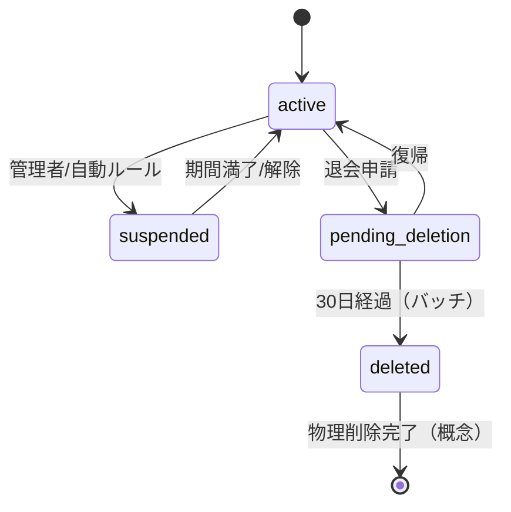

# 状態遷移・データ保持・権限設計

## 位置情報方針
- 投稿（Post）はPinが未設定でも作成可能
- 投稿は後からPinの追加・変更・削除が可能
- 地図に載せるか（&精度）は投稿ごとのユーザー設定で制御：
  - map_visibility: none（既定／地図に出さない）｜approx_100m（おおよそ100mで丸め）｜exact（正確）
- 地図に載せる座標はposts.display_point GEOGRAPHY(POINT,4326)に保持
- ベース座標の優先順位：Pin → EXIF/端末GPS → （なければ無し）
- map_visibilityに応じてdisplay_pointを生成／更新（noneならNULL）
- Pinは丸めない（施設は公知情報）。プライバシーは投稿側の地図表示設定で担保

## 1. 状態遷移図（ステートマシン）

### 1.0 Profiles（アカウント）の状態遷移

#### アカウント状態（profiles.status）
- **active**: 通常利用。RLS/API制限なし。
- **suspended**: ログイン可 / **投稿・メディアは他者に非公開**（オーナーは閲覧のみ可）/ 書き込み系（Post/Media/Pin作成・更新）**禁止**。
- **pending_deletion**: 退会申請後30日間の猶予期間。ログイン可 / **第三者に完全不可視** / 書き込み系**禁止**。
- **deleted**: ログイン不可 / **この時点で物理削除**（投稿・メディア・プロフィール・auth.users、Storage/Stream含む）

#### アカウント状態遷移図



- **pending_deletion** は30日間の猶予期間。本人ログイン可・第三者不可視。
- **deleted** は物理削除完了後の概念状態（DB上ではレコード消滅）。

#### アカウント状態遷移マトリクス

| 現在の状態 | 次の状態 | 許可条件 | ガード条件 |
|-----------|---------|---------|-----------|
| active | suspended | 管理者操作 or 自動ルール | suspended_until設定、moderation_note記録 |
| suspended | active | 期間満了 or 管理者解除 | suspended_until < NOW() or 管理者操作 |
| active | pending_deletion | ユーザー退会申請 | deleted_at = NOW()、**profiles.deleted_at=NOW() を"タイマー起点"として記録** |
| pending_deletion | active | 本人操作：復帰 | deleted_at = NULL |
| pending_deletion | deleted | 30日経過：バッチ | バッチ処理による物理削除 |

### 1.1 Post（投稿）の状態遷移

#### 状態定義（ENUM型で管理）
- **draft**: 下書き状態（未公開、Pin未設定でも可）
- **temporary**: 24時間限定公開状態（expires_at併用、Pin未設定でも可）
- **published**: 恒久公開状態
- **archived**: アーカイブ済み（privateとして扱う）
- **deleted**: 論理削除済み（deleted_at != null、status='deleted'）

#### 状態遷移マトリクス

| 現在の状態 | 次の状態 | 許可条件 | ガード条件 |
|-----------|---------|---------|-----------|
| draft | temporary | ユーザー公開操作 | has_media = true、expires_at = NOW() + 24h |
| draft | deleted | ユーザー削除 | deleted_at = NOW() |
| temporary | published | 24時間後の明示選択 | - |
| temporary | archived | 24時間経過（無応答）or 明示選択 | expires_at < NOW() |
| temporary | deleted | ユーザー削除 | deleted_at = NOW() |
| published | archived | ユーザー操作 | - |
| published | deleted | ユーザー削除 | deleted_at = NOW() |
| archived | published | ユーザー操作 | user_id = auth.uid() |
| archived | deleted | ユーザー削除 | deleted_at = NOW() |

#### 禁止遷移
- published → draft（公開後の下書き戻しは不可）
- temporary → draft（一度公開したものは下書きに戻せない）
- deleted → *（削除後の復帰は不可、30日保持は災害復旧用）

### 1.2 Media（メディアファイル）の状態遷移

#### 状態定義（media_files.status）
- **uploading**: アップロード中
- **processing**: 処理中（サムネイル生成、トランスコード等）
- **ready**: 利用可能
- **failed**: 処理失敗
- **deleted**: 削除済み（deleted_at != null）

#### 状態遷移マトリクス

| 現在の状態 | 次の状態 | 許可条件 | ガード条件 |
|-----------|---------|---------|-----------|
| uploading | processing | アップロード完了 | file_size > 0、checksum検証 |
| uploading | failed | エラー発生 | - |
| processing | ready | 処理完了 | stream_uid != null（動画の場合） |
| processing | failed | 処理エラー | - |
| ready | deleted | 投稿削除 or ユーザー操作 | deleted_at = NOW() |
| failed | uploading | 再試行 | retry_count < 3 |

#### 属性管理
- **画像**: file_size, width, height, type='image'
- **動画**: file_size, duration_seconds, stream_uid（Cloudflare Stream）, type='video'
- **可視性（media_files.visibility）**: 'inherit'｜'public'｜'friends'｜'private'（既定は 'inherit'）。**親投稿より広い設定は不可（DBトリガで強制）**

### 1.3 Follow/Friend関係の状態遷移

#### Follow状態
- **following**: フォロー中
- **not_following**: 未フォロー

#### Friend状態
- **none**: 関係なし
- **pending**: 申請中
- **accepted**: 友達（双方向レコード自動生成）
- **blocked**: ブロック中（blocksテーブルで管理）

#### 状態遷移マトリクス（Friend）

| 現在の状態 | 次の状態 | 許可条件 | ガード条件 |
|-----------|---------|---------|-----------|
| none | pending | 友達申請 | 相互フォロー必須（DBトリガで強制） |
| pending | accepted | 承認 | 受信者の明示的承認 |
| pending | none | 拒否 or キャンセル | - |
| accepted | none | 友達解除 | 双方向レコード同時削除 |

#### Block管理（別テーブル）
- blocksテーブルで一方向のブロック関係を管理
- ブロック中は全ての閲覧・操作を相互に遮断
- RLSポリシーで最優先評価（早期return）

## 2. データ保持・削除方針

### 2.1 削除方式の基本原則

| データ種別 | 削除方式 | 実装方法 | 復旧可能性 |
|-----------|---------|----------|-----------|
| **ユーザープロファイル** | pending_deletion（30日保持、**匿名化なし**）→ deleted（即時物理削除） | profiles.status='pending_deletion'、deleted_at記録 → 30日後に物理削除 | 30日以内は復帰可能 |
| **投稿（Posts）** | （個別削除）論理→30日後物理 ／（アカウント削除）**満了時（30日経過時）に物理削除** | 個別削除: deleted_at設定→30日後バッチ ／ アカウント削除: purgeで満了時物理 | 個別: 災害復旧のみ |
| **メディアファイル** | 段階削除 | DB論理削除 → 30日後にStorage/Stream物理削除 | 30日以内はDB復旧可能 |
| **Pin（場所情報）** | 参照カウント管理 | 投稿数0になったら非表示化 | 新規投稿で自動復活 |
| **Pin属性キャッシュ** | TTL自動削除 | pin_attributes.cached_until期限切れで削除 | 不可（再取得必要） |
| **位置情報生データ** | 30日自動削除 | post_geo_eventsから30日後に物理削除（display_point生成の参考ソース） | 不可 |
| **display_point** | 投稿本体の列として保持 | 削除方針は投稿に従う | - |
| **ソーシャル関係** | 即時物理削除 | CASCADE削除 | 不可 |
| **アクセスログ** | 自動パージ | 90日後に物理削除 | 不可 |

### 2.2 保持期間ポリシー

| データ種別 | 通常保持期間 | 削除後保持期間 | パージタイミング |
|-----------|-------------|----------------|---------------|
| **投稿データ** | 無期限 | 30日（deleted_at後） | 毎日00:00 バッチ |
| **メディア原本** | 無期限 | 30日（deleted_at後） | 毎日03:00 バッチ |
| **メディアキャッシュ** | 30-90日 | 即時削除 | CDN TTL期限 |
| **一時投稿** | 24時間 | archived移行 | 毎分チェック |
| **Pin属性（Google）** | 30分-数時間（詳細）/ 30日（座標） | - | cached_until期限 |
| **位置情報生データ** | 30日 | - | 毎日00:00 バッチ |
| **認証ログ** | 180日 | - | 毎月1日 バッチ |
| **APIアクセスログ** | 90日 | - | 毎週日曜 バッチ |
| **エラーログ** | 30日 | - | 毎日05:00 バッチ |

### 2.3 ユーザー退会・モデレーション時の処理

#### 退会・モデレーション処理フロー

1. **退会申請（即時）**
   - profiles.status='pending_deletion'
   - profiles.deleted_at=NOW()
   - **post/mediaは触らない**

2. **30日後の削除**
   - profiles.status='deleted' に遷移させた直後に **post/media/profiles を物理削除**（Storage/Stream/API含む）
   - 最後に auth.users 削除

3. **復帰**
   - pending_deletion → active（deleted_at=NULL）
   - **post/mediaは触らない**（即座に再可視化）

#### モデレーション処理フロー
1. **suspended 状態**
   - 新規投稿・編集・削除を禁止（DBトリガで強制）
   - 既存投稿・メディアは他者から非表示（RLS適用）
   - 本人は自身のコンテンツ閲覧可能

2. **deleted 状態**
   - ログイン時にクライアント側で即座に拒否
   - アカウント削除と同じ処理フローを適用

### 2.4 バッチ処理仕様

```sql
-- 30日経過した pending_deletion アカウントの完全削除
WITH c AS (
  SELECT id
  FROM profiles
  WHERE status = 'pending_deletion'
    AND deleted_at < NOW() - INTERVAL '30 days'
)
-- メディアの物理削除（Storage/Stream APIはアプリ側で同時呼び出し）
DELETE FROM media_files
WHERE post_id IN (SELECT id FROM posts WHERE user_id IN (SELECT id FROM c));

DELETE FROM posts
WHERE user_id IN (SELECT id FROM c);

-- profiles を最後に削除
DELETE FROM profiles
WHERE id IN (SELECT id FROM c);

-- auth.users は管理APIで削除（実装ノートに明記）

-- 期限切れ一時投稿のアーカイブ化（毎分実行）
UPDATE posts 
SET status = 'archived',
    visibility = 'private'
WHERE status = 'temporary'
  AND expires_at < NOW();

-- Pin属性キャッシュの期限切れ削除
DELETE FROM pin_attributes 
WHERE cached_until < NOW();

-- 30日経過した位置情報生データの削除
DELETE FROM post_geo_events 
WHERE captured_at < NOW() - INTERVAL '30 days';

```

## 3. 権限/RLS原則（モデレーション対応）

### 3.0 モデレーション方針

#### RLS 方針（要点）
- **READ（非オーナー）**: owner.status='active' のみ許可。suspended/deleted の所有者コンテンツは非表示。
- **READ（オーナー自身）**: suspended でも閲覧可。deleted はログイン不可なので到達しない。
- **WRITE**（INSERT/UPDATE/DELETE）: 所有者 status='active' の場合のみ許可。

#### モデレーション状態別アクセス制御

| アカウント状態 | ログイン | 自分のコンテンツ閲覧 | 他者からの閲覧 | 新規投稿・編集 |
|-------------|---------|----------------|-------------|--------------|
| active | ✓ | ✓ | ✓ | ✓ |
| suspended | ✓ | ✓ | × | × |
| pending_deletion | ✓ | ✓ | × | × |
| deleted | × | × | × | × |

## 3. 権限/RLS原則

### 3.1 主体（Actor）の定義

| 主体 | 説明 | 識別方法 |
|------|------|----------|
| **owner** | リソース所有者 | user_id = auth.uid() |
| **friend** | 友達（相互承認済み） | EXISTS(friends WHERE status = 'accepted') |
| **public** | 一般ユーザー（認証済み） | auth.uid() IS NOT NULL |
| **anonymous** | 未認証ユーザー | auth.uid() IS NULL |
| **blocked** | ブロック関係 | EXISTS(blocks WHERE blocker/blocked) |
| **admin** | 管理者 | auth.jwt() ->> 'role' = 'admin' |

### 3.2 可視範囲（Visibility）の定義（MVP）

| 可視範囲 | 説明 | アクセス可能な主体 |
|---------|------|------------------|
| **public** | 全体公開 | すべて（anonymous含む） |
| **friends** | 友達限定 | owner, friend, admin |
| **private** | 非公開 | owner, admin |

※ **followers専用の閲覧権限（visibilityレベル）** はMVPでは実装しない（閲覧権限制御は public/friends/private のみ、followはフィード整列用）

### 3.3 権限マトリクス（概念）

#### Posts（投稿）

| 主体 | CREATE | READ | UPDATE | DELETE | 条件 |
|------|--------|------|--------|--------|------|
| owner | ✓ | ✓ | ✓ | ✓ | pin_id/map_visibility更新可 |
| friend | - | ✓ | - | - | visibility ∈ {public, friends} |
| public | - | ✓ | - | - | visibility = public |
| anonymous | - | ✓ | - | - | visibility = public |
| blocked | - | × | - | - | ブロック関係がある場合は全て拒否 |
| admin | - | ✓ | - | - | 監査目的のみ |

#### Profiles（プロファイル）

| 主体 | CREATE | READ | UPDATE | DELETE | 条件 |
|------|--------|------|--------|--------|------|
| owner | ✓ | ✓ | ✓ | ✓ | - |
| friend | - | ✓ | - | - | 詳細情報を含む |
| public | - | ✓ | - | - | 公開情報のみ（public_profilesビュー経由） |
| anonymous | - | ✓ | - | - | 公開情報のみ（public_profilesビュー経由） |
| blocked | - | × | - | - | ブロック関係がある場合は拒否 |
| admin | - | ✓ | - | - | 全情報（監査用） |

#### Media Files（メディア）

| 主体 | CREATE | READ | UPDATE | DELETE | 条件 |
|------|--------|------|--------|--------|------|
| owner | ✓ | ✓ | ✓ | ✓ | post.user_id = auth.uid() |
| friend | - | ✓ | - | - | post.visibility ∈ {public, friends} |
| public | - | ✓ | - | - | post.visibility = public |
| anonymous | - | ✓ | - | - | post.visibility = public |
| blocked | - | × | - | - | ブロック関係がある場合は拒否 |
| admin | - | ✓ | - | - | 監査目的のみ |

#### Pins（場所タグ）

| 主体 | CREATE | READ | UPDATE | DELETE | 条件 |
|------|--------|------|--------|--------|------|
| owner | ✓ | ✓ | ✓ | ✓ | created_by = auth.uid() |
| public | ✓ | ✓ | - | - | 認証済みユーザー |
| anonymous | - | ✓ | - | - | 公開投稿に紐づくPinのみ |
| admin | - | ✓ | ✓ | - | 不適切コンテンツ修正用 |

### 3.4 衝突解決原則

#### 可視性の優先順位
1. **ブロック関係** → 最優先（すべてのアクセスを遮断）
2. **削除済み/期限切れ** → deleted_at != null または status = 'deleted' の場合は非公開
3. **プライバシー設定** → owner の visibility 設定を尊重
4. **ソーシャル関係** → friend > public > anonymous の順で評価
5. **最小権限の原則** → 複数の条件が競合する場合は最も制限的な条件を適用

#### 例外処理
- **退会申請中ユーザー**: status='pending_deletion'（deleted_at IS NOT NULL）時は第三者から完全不可視
- **一時投稿の期限切れ**: status = 'temporary' AND expires_at < NOW() → 自動的に archived（private扱い）
- **管理者権限**: 監査・コンプライアンス目的のREADのみ許可（更新は専用API経由）

### 3.5 実装パターン（RLSポリシー例）

```sql
-- Posts読み取りポリシー（モデレーション対応版）
CREATE POLICY posts_select_policy ON posts
FOR SELECT USING (
  -- ブロック関係がある場合は即座に拒否（最優先）
  NOT EXISTS (
    SELECT 1 FROM blocks b
    WHERE (b.blocker_id = auth.uid() AND b.blocked_id = posts.user_id)
       OR (b.blocker_id = posts.user_id AND b.blocked_id = auth.uid())
  )
  AND posts.deleted_at IS NULL
  AND (
    posts.user_id = auth.uid()  -- オーナーは閲覧可（suspendedでも）
    OR (
      -- 非オーナー: 所有者が active のときだけ
      EXISTS (
        SELECT 1 FROM profiles pr
        WHERE pr.id = posts.user_id
          AND pr.status = 'active'
          AND pr.deleted_at IS NULL
      )
      AND posts.status <> 'deleted'
      AND (
        posts.visibility = 'public'
        OR (
          posts.visibility = 'friends'
          AND EXISTS (
            SELECT 1 FROM friends
            WHERE user_id = auth.uid()
              AND friend_id = posts.user_id
              AND status = 'accepted'
          )
        )
      )
    )
  )
);

-- Media Files読み取りポリシー（モデレーション対応版）
CREATE POLICY media_files_select ON media_files
FOR SELECT USING (
  media_files.deleted_at IS NULL
  AND EXISTS (
    SELECT 1 FROM posts p
    JOIN profiles pr ON pr.id = p.user_id
    WHERE p.id = media_files.post_id
      AND p.deleted_at IS NULL
      AND p.status <> 'deleted'
      AND NOT EXISTS (
        SELECT 1 FROM blocks b
        WHERE (b.blocker_id = auth.uid() AND b.blocked_id = p.user_id)
           OR (b.blocker_id = p.user_id AND b.blocked_id = auth.uid())
      )
      AND (
        p.user_id = auth.uid()  -- オーナーは閲覧可
        OR (
          pr.status = 'active'  -- 非オーナーは所有者がactiveの場合のみ
          AND (
            CASE media_files.visibility
              WHEN 'inherit' THEN p.visibility
              ELSE media_files.visibility
            END = 'public'
            OR (
              CASE media_files.visibility
                WHEN 'inherit' THEN p.visibility
                ELSE media_files.visibility
              END = 'friends'
              AND EXISTS (
                SELECT 1 FROM friends
                WHERE user_id = auth.uid()
                  AND friend_id = p.user_id
                  AND status = 'accepted'
              )
            )
          )
        )
      )
  )
);

-- 公開プロフィールビュー（モデレーション対応版）
CREATE OR REPLACE VIEW public_profiles AS
SELECT id, username, display_name, avatar_url
FROM profiles
WHERE deleted_at IS NULL
  AND status IN ('active','suspended');  -- suspendedも表示（UIでバッジ表示）

-- 権限付与（anonymousユーザーにもpublic読み取りを許可）
GRANT SELECT ON posts TO anon, authenticated;
GRANT INSERT, UPDATE, DELETE ON posts TO authenticated;
GRANT SELECT ON media_files TO anon, authenticated;
GRANT SELECT ON pins TO anon, authenticated;

-- Pins読み取りポリシー（公開投稿に紐づく場合のみ匿名OK）
CREATE POLICY pins_select ON pins
FOR SELECT USING (
  EXISTS (
    SELECT 1 FROM posts p
    WHERE p.pin_id = pins.id
      AND p.deleted_at IS NULL
      AND p.status <> 'deleted'
      AND (
        p.user_id = auth.uid()                       -- オーナー
        OR p.visibility = 'public'                   -- 公開
        OR (
          p.visibility = 'friends' AND               -- 友達限定
          EXISTS (
            SELECT 1 FROM friends
            WHERE user_id = auth.uid()
              AND friend_id = p.user_id
              AND status = 'accepted'
          )
        )
      )
  )
  OR auth.jwt() ->> 'role' = 'admin'                -- 管理者は監査目的で閲覧可
);
```

## 4. 実装チェックリスト

### 状態遷移実装
- [ ] Post status ENUM型の作成
- [ ] posts.is_temporaryをstatus列に移行
- [ ] deleted_atカラムの追加（posts, media_files）
- [ ] 状態遷移バリデーション関数
- [ ] 24時間レビュー用の毎分実行ジョブ
- [ ] 状態変更時のWebhook設定

### データ保持実装
- [ ] pin_attributesテーブルの作成（TTLキャッシュ用）
- [ ] post_geo_eventsテーブルの作成（位置情報生データ保持）
- [ ] blocksテーブルの作成（ブロック関係管理）
- [ ] media_filesへの動画属性カラム追加（stream_uid, duration_seconds等）
- [ ] media_files.visibility 列（ENUM 'inherit'|'public'|'friends'|'private'）の追加
- [ ] enforce_media_tighten_only トリガ関数とトリガの作成
- [ ] 匿名化処理関数
- [ ] バッチ削除ジョブ（Supabase Edge Functions）
- [ ] Storage/Stream削除連携

### 権限実装
- [ ] RLSポリシーの作成（followersを除外したMVP版）
- [ ] blocksテーブルのRLSポリシー
- [ ] 相互フォロー強制トリガー（friend申請時）
- [ ] public_profilesビューの作成
- [ ] anonymousユーザーへのGRANT設定
- [ ] 管理者ロールの設定
- [ ] 権限テストスイート

## 5. 監視指標

### 状態遷移メトリクス
- 各状態の投稿数分布
- 状態遷移の成功率
- 24時間レビューの選択率

### データ保持メトリクス
- 論理削除/物理削除の件数
- ストレージ使用量の推移
- バッチ処理の実行時間

### 権限メトリクス
- RLSポリシーの評価時間
- アクセス拒否率
- 権限エラーの発生頻度