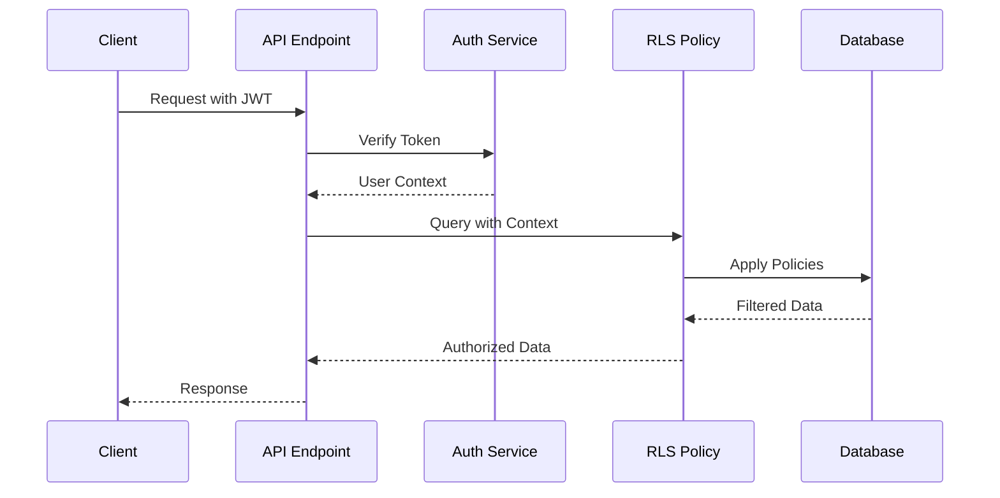

# BE-006: プロファイルAPI実装

## 基本情報

- **フェーズ**: 4 - プロファイル管理
- **優先度**: High
- **見積もり**: 4h
- **前提条件**: BE-003完了
- **タイプ**: Backend

## 実装内容

### 主要タスク

- [ ] GET /api/v1/profiles/{user_id}:
  - 匿名アクセス対応（public_profiles ビュー使用）
  - suspended/pending_deletionの可視性制御
  - カウント集計（followers_count, following_count, posts_count）
- [ ] PATCH /api/v1/profiles/{user_id}:
  - 本人チェック（auth.uid() = user_id）
  - username重複チェック
  - 画像URL検証
- [ ] プロファイル画像処理:
  - Storage Image Transformations設定
  - サムネイル自動生成（150x150, 300x300）

### 詳細実装

1. **GET /api/v1/profiles/{user_id}**:

   ```typescript
   export async function GET(request: Request, { params }: { params: { user_id: string } }) {
     const { user_id } = params;
     const authUser = await getAuthUser(request); // 匿名の場合null

     // 匿名アクセスの場合はpublic_profilesビューを使用
     const profileQuery = authUser
       ? supabase.from('profiles').select(`
           id, username, display_name, bio, avatar_url, header_url,
           location, website_url, created_at, updated_at, status,
           (SELECT COUNT(*) FROM follows WHERE following_id = profiles.id) as followers_count,
           (SELECT COUNT(*) FROM follows WHERE follower_id = profiles.id) as following_count,
           (SELECT COUNT(*) FROM posts WHERE user_id = profiles.id AND status = 'published') as posts_count
         `)
       : supabase.from('public_profiles').select(`
           id, username, display_name, bio, avatar_url, header_url,
           location, website_url, created_at,
           followers_count, following_count, posts_count
         `);

     const { data: profile, error } = await profileQuery.eq('id', user_id).single();

     if (error || !profile) {
       return new Response(
         JSON.stringify({ error: { code: 'PROFILE_NOT_FOUND', message: 'Profile not found' } }),
         { status: 404, headers: { 'Content-Type': 'application/json' } },
       );
     }

     // suspended/pending_deletionユーザーの可視性制御
     if (profile.status === 'suspended' && (!authUser || authUser.id !== user_id)) {
       return new Response(
         JSON.stringify({ error: { code: 'PROFILE_SUSPENDED', message: 'Profile is suspended' } }),
         { status: 403, headers: { 'Content-Type': 'application/json' } },
       );
     }

     if (profile.status === 'pending_deletion') {
       return new Response(
         JSON.stringify({ error: { code: 'PROFILE_NOT_FOUND', message: 'Profile not found' } }),
         { status: 404, headers: { 'Content-Type': 'application/json' } },
       );
     }

     return new Response(JSON.stringify(profile), {
       headers: { 'Content-Type': 'application/json' },
     });
   }
   ```

2. **PATCH /api/v1/profiles/{user_id}**:

   ```typescript
   export async function PATCH(request: Request, { params }: { params: { user_id: string } }) {
     const { user_id } = params;
     const authUser = await getAuthUser(request);

     if (!authUser || authUser.id !== user_id) {
       return new Response(
         JSON.stringify({
           error: { code: 'UNAUTHORIZED', message: 'Not authorized to update this profile' },
         }),
         { status: 403, headers: { 'Content-Type': 'application/json' } },
       );
     }

     const updateData = await request.json();
     const { username, display_name, bio, avatar_url, header_url, location, website_url } =
       updateData;

     // バリデーション
     const validationErrors = [];
     if (username && (username.length < 3 || username.length > 30)) {
       validationErrors.push('Username must be between 3 and 30 characters');
     }
     if (username && !/^[a-zA-Z0-9_-]+$/.test(username)) {
       validationErrors.push(
         'Username can only contain letters, numbers, underscores, and hyphens',
       );
     }
     if (display_name && display_name.length > 50) {
       validationErrors.push('Display name must be 50 characters or less');
     }
     if (bio && bio.length > 300) {
       validationErrors.push('Bio must be 300 characters or less');
     }
     if (website_url && !isValidUrl(website_url)) {
       validationErrors.push('Invalid website URL');
     }

     if (validationErrors.length > 0) {
       return new Response(
         JSON.stringify({
           error: {
             code: 'VALIDATION_ERROR',
             message: 'Validation failed',
             details: validationErrors,
           },
         }),
         { status: 400, headers: { 'Content-Type': 'application/json' } },
       );
     }

     // username重複チェック
     if (username) {
       const { data: existingUser } = await supabase
         .from('profiles')
         .select('id')
         .eq('username', username)
         .neq('id', user_id)
         .single();

       if (existingUser) {
         return new Response(
           JSON.stringify({
             error: { code: 'USERNAME_TAKEN', message: 'Username is already taken' },
           }),
           { status: 409, headers: { 'Content-Type': 'application/json' } },
         );
       }
     }

     // 更新実行
     const { data: updatedProfile, error } = await supabase
       .from('profiles')
       .update({
         username,
         display_name,
         bio,
         avatar_url,
         header_url,
         location,
         website_url,
         updated_at: new Date().toISOString(),
       })
       .eq('id', user_id)
       .select()
       .single();

     if (error) {
       console.error('Profile update error:', error);
       return new Response(
         JSON.stringify({ error: { code: 'UPDATE_FAILED', message: 'Failed to update profile' } }),
         { status: 500, headers: { 'Content-Type': 'application/json' } },
       );
     }

     return new Response(JSON.stringify(updatedProfile), {
       headers: { 'Content-Type': 'application/json' },
     });
   }
   ```

3. **画像処理設定**:

   ```sql
   -- Storage Image Transformations設定
   -- Supabaseダッシュボードで設定するか、SQL関数で実装

   CREATE OR REPLACE FUNCTION generate_profile_thumbnails()
   RETURNS TRIGGER AS $$
   BEGIN
     -- avatar_url更新時にサムネイル生成トリガー（Supabase Image Transformationsで自動処理）
     -- 実際の変換はクライアント側で指定: ?width=150&height=150&resize=cover
     RETURN NEW;
   END;
   $$ LANGUAGE plpgsql;

   CREATE TRIGGER profile_avatar_update
     AFTER UPDATE OF avatar_url ON profiles
     FOR EACH ROW
     WHEN (OLD.avatar_url IS DISTINCT FROM NEW.avatar_url)
     EXECUTE FUNCTION generate_profile_thumbnails();
   ```

### バリデーション関数

```typescript
// utils/validation.ts
export const isValidUrl = (url: string): boolean => {
  try {
    const parsedUrl = new URL(url);
    return ['http:', 'https:'].includes(parsedUrl.protocol);
  } catch {
    return false;
  }
};

export const sanitizeUsername = (username: string): string => {
  return username.toLowerCase().replace(/[^a-z0-9_-]/g, '');
};

export const validateImageUrl = (url: string): boolean => {
  if (!isValidUrl(url)) return false;
  const validExtensions = ['.jpg', '.jpeg', '.png', '.gif', '.webp'];
  return validExtensions.some((ext) => url.toLowerCase().includes(ext));
};
```

## 参照ドキュメント

- `api-interface.md`: 2. プロファイル (Profiles)
- `data-model.md`: 1. profiles（プロファイル）
- `design.md`: public_profiles の使い分け

## テスト内容

- [ ] プロファイル取得API（認証済み・匿名）が正常に動作すること
- [ ] suspended/pending_deletionユーザーの可視性制御が正しく動作すること
- [ ] プロファイル更新APIが本人のみ実行可能であること
- [ ] username重複チェックが機能すること
- [ ] バリデーションエラーが適切に返却されること
- [ ] カウント集計（フォロワー数等）が正確であること

## セキュリティ考慮事項

- [ ] 本人確認の適切な実装
- [ ] 入力値のサニタイゼーション
- [ ] XSS対策（bio、display_name等）
- [ ] 画像URLの検証
- [ ] RLSポリシーとの整合性確認
- [ ] 機密情報の適切な除外

## パフォーマンス考慮事項

- [ ] カウント集計のクエリ最適化
- [ ] public_profilesビューの活用
- [ ] インデックスの適切な設定
- [ ] 画像変換の最適化
- [ ] キャッシュ戦略の実装準備

## 完了チェック

- [ ] GET /api/v1/profiles/{user_id}が実装されている
- [ ] PATCH /api/v1/profiles/{user_id}が実装されている
- [ ] 匿名アクセス対応が完了している
- [ ] 画像処理設定が完了している
- [ ] バリデーション処理が適切に実装されている
- [ ] 次フェーズ（FE-004）の前提条件が満たされている

## エラーコード定義

```typescript
export const PROFILE_ERROR_CODES = {
  PROFILE_NOT_FOUND: 'PROFILE_NOT_FOUND',
  PROFILE_SUSPENDED: 'PROFILE_SUSPENDED',
  USERNAME_TAKEN: 'USERNAME_TAKEN',
  UNAUTHORIZED: 'UNAUTHORIZED',
  VALIDATION_ERROR: 'VALIDATION_ERROR',
  UPDATE_FAILED: 'UPDATE_FAILED',
} as const;
```

## 注意事項

- public_profilesビューは事前にBE-003で作成されている必要がある
- 画像処理はSupabase Image Transformationsの機能を活用
- usernameの変更頻度制限を将来的に検討（現在は制限なし）
- カウント集計は後続フェーズでキャッシュ最適化予定

## 実装戦略

### 概要

BE-006では、RovRov SNSアプリのプロファイル管理APIを実装します。このAPIは、セキュリティファーストの設計思想に基づき、匿名アクセスと認証済みアクセスの両方をサポートし、RLSポリシーと連携して堅牢なアクセス制御を実現します。

### 1. 実装アプローチ

#### 1.1 アーキテクチャ方針

**セキュリティレイヤー構成**

```
クライアント → API Gateway → Supabase Edge Functions → RLS → Database
```

- **第1層（API Gateway）**: レート制限、CORS、基本的な入力検証
- **第2層（Edge Functions）**: ビジネスロジック、詳細なバリデーション、認証状態判定
- **第3層（RLS）**: データベースレベルのアクセス制御、ブロック関係の強制
- **第4層（Database）**: トランザクション整合性、データ永続化

#### 1.2 認証状態による処理分岐

```typescript
// 認証状態判定パターン
const authStrategy = {
  anonymous: {
    view: 'public_profiles',
    fields: [
      'id',
      'username',
      'display_name',
      'bio',
      'avatar_url',
      'header_url',
      'location',
      'website_url',
      'created_at',
    ],
    excludes: ['status', 'updated_at', 'deleted_at'],
  },
  authenticated: {
    table: 'profiles',
    fields: '*',
    withCounts: true,
    rlsApplied: true,
  },
};
```

#### 1.3 データアクセスパターン

**読み取り系（GET）**

- 匿名: `public_profiles`ビュー → キャッシュ可能、CDN配信可能
- 認証済み: `profiles`テーブル → リアルタイムカウント、完全情報

**書き込み系（PATCH）**

- 本人確認必須: `auth.uid() === user_id`
- トランザクション処理: username重複チェック → 更新 → 履歴記録
- 楽観的ロック: `updated_at`による同時更新制御

### 2. セキュリティ考慮事項

#### 2.1 多層防御戦略

**入力検証階層**

```typescript
// レベル1: 型検証
const validateTypes = (data: unknown): data is ProfileUpdateData => {
  // TypeScript型ガード実装
};

// レベル2: 形式検証
const validateFormat = (data: ProfileUpdateData): ValidationResult => {
  // 正規表現、文字数制限
};

// レベル3: ビジネスルール検証
const validateBusinessRules = async (data: ProfileUpdateData): Promise<ValidationResult> => {
  // username重複、画像URL到達性
};

// レベル4: サニタイゼーション
const sanitizeData = (data: ProfileUpdateData): SanitizedData => {
  // XSS対策、SQLエスケープ
};
```

#### 2.2 攻撃対策実装

**XSS（クロスサイトスクリプティング）対策**

```typescript
import DOMPurify from 'isomorphic-dompurify';

const sanitizeUserInput = (input: string): string => {
  // HTMLタグの完全除去
  const stripped = input.replace(/<[^>]*>/g, '');

  // 特殊文字のエスケープ
  const escaped = stripped
    .replace(/&/g, '&amp;')
    .replace(/</g, '&lt;')
    .replace(/>/g, '&gt;')
    .replace(/"/g, '&quot;')
    .replace(/'/g, '&#x27;')
    .replace(/\//g, '&#x2F;');

  // 追加のサニタイゼーション
  return DOMPurify.sanitize(escaped, {
    ALLOWED_TAGS: [],
    ALLOWED_ATTR: [],
  });
};
```

**SQLインジェクション対策**

```typescript
// パラメータバインディングの徹底
const updateProfile = async (userId: string, data: ProfileData) => {
  // NG: 文字列連結
  // const query = `UPDATE profiles SET username = '${data.username}'`;

  // OK: パラメータバインディング
  const { data: profile, error } = await supabase
    .from('profiles')
    .update(data)
    .eq('id', userId) // Supabase内部でパラメータ化
    .single();
};
```

#### 2.3 認証・認可フロー



### 3. パフォーマンス最適化戦略

#### 3.1 クエリ最適化

**カウント集計の最適化**

```sql
-- 非効率: サブクエリの多重実行
SELECT
  *,
  (SELECT COUNT(*) FROM follows WHERE following_id = p.id) as followers_count,
  (SELECT COUNT(*) FROM follows WHERE follower_id = p.id) as following_count,
  (SELECT COUNT(*) FROM posts WHERE user_id = p.id AND status = 'published') as posts_count
FROM profiles p;

-- 効率的: ラテラルジョインとマテリアライズドビュー
WITH profile_stats AS (
  SELECT
    user_id,
    COUNT(*) FILTER (WHERE type = 'follower') as followers_count,
    COUNT(*) FILTER (WHERE type = 'following') as following_count
  FROM (
    SELECT following_id as user_id, 'follower' as type FROM follows
    UNION ALL
    SELECT follower_id as user_id, 'following' as type FROM follows
  ) t
  GROUP BY user_id
)
SELECT p.*, ps.*
FROM profiles p
LEFT JOIN profile_stats ps ON p.id = ps.user_id;
```

#### 3.2 インデックス戦略

```sql
-- 主要インデックス
CREATE INDEX idx_profiles_username_lower ON profiles((lower(username)));
CREATE INDEX idx_profiles_status ON profiles(status) WHERE status != 'active';
CREATE INDEX idx_follows_following_id ON follows(following_id);
CREATE INDEX idx_follows_follower_id ON follows(follower_id);
CREATE INDEX idx_posts_user_status ON posts(user_id, status) WHERE status = 'published';

-- 複合インデックス（頻繁なクエリパターン用）
CREATE INDEX idx_profiles_status_deleted ON profiles(status, deleted_at)
  WHERE status IN ('suspended', 'pending_deletion');
```

#### 3.3 キャッシュ戦略

```typescript
// Redis/Memcachedレイヤー（将来実装）
const cacheStrategy = {
  publicProfiles: {
    ttl: 300, // 5分
    key: `public_profile:${userId}`,
    invalidateOn: ['profile_update', 'status_change'],
  },
  profileCounts: {
    ttl: 60, // 1分
    key: `profile_counts:${userId}`,
    invalidateOn: ['follow', 'unfollow', 'post_create', 'post_delete'],
  },
};

// Edge Cacheヘッダー設定
const setCacheHeaders = (response: Response, isPublic: boolean) => {
  if (isPublic) {
    response.headers.set('Cache-Control', 'public, max-age=300, s-maxage=600');
    response.headers.set('CDN-Cache-Control', 'max-age=600');
  } else {
    response.headers.set('Cache-Control', 'private, no-cache, must-revalidate');
  }
};
```

### 4. 実装順序と段階

#### フェーズ1: 基盤構築（2時間）

1. **データベース準備**
   - RLSポリシー確認と調整
   - インデックス作成
   - public_profilesビューの検証
   - テスト用データシード作成

2. **共通モジュール実装**
   - バリデーション関数群
   - サニタイゼーション処理
   - エラーハンドリング統一
   - 認証ヘルパー関数

3. **型定義とインターフェース**

   ```typescript
   // types/profile.ts
   interface ProfileData {
     id: string;
     username: string;
     display_name: string | null;
     bio: string | null;
     avatar_url: string | null;
     header_url: string | null;
     location: string | null;
     website_url: string | null;
     status: 'active' | 'suspended' | 'pending_deletion';
     created_at: string;
     updated_at: string;
     deleted_at: string | null;
   }

   interface ProfileStats {
     followers_count: number;
     following_count: number;
     posts_count: number;
   }
   ```

#### フェーズ2: GET API実装（1時間）

1. **エンドポイント実装**
   - 認証状態判定ロジック
   - ビュー/テーブル切り替え
   - カウント集計処理
   - エラーハンドリング

2. **セキュリティ層実装**
   - UUID形式検証
   - ブロック関係チェック
   - suspended/pending_deletion制御
   - レスポンスフィルタリング

3. **パフォーマンス最適化**
   - クエリ最適化
   - N+1問題回避
   - キャッシュヘッダー設定

#### フェーズ3: PATCH API実装（1時間）

1. **更新処理実装**
   - 本人確認ロジック
   - バリデーション処理
   - username重複チェック
   - トランザクション処理

2. **画像処理統合**
   - URL検証
   - Supabase Image Transformations連携
   - サムネイル生成トリガー

3. **監査ログ実装**
   ```typescript
   // 更新履歴記録
   const auditLog = {
     user_id: userId,
     action: 'profile_update',
     changes: diff(oldProfile, newProfile),
     ip_address: request.headers.get('CF-Connecting-IP'),
     user_agent: request.headers.get('User-Agent'),
     timestamp: new Date().toISOString(),
   };
   ```

#### フェーズ4: テストとドキュメント（30分）

1. **統合テスト実装**
   - 正常系シナリオ
   - 異常系シナリオ
   - セキュリティテスト
   - パフォーマンステスト

2. **ドキュメント更新**
   - APIドキュメント
   - エラーコード一覧
   - 使用例とベストプラクティス

### 5. テスト戦略

#### 5.1 テスト分類と優先度

**優先度1: セキュリティテスト**

- 認証・認可の境界値テスト
- インジェクション攻撃の防御確認
- データ漏洩防止の検証

**優先度2: 機能テスト**

- CRUD操作の正常動作
- バリデーションルールの適用
- ビジネスロジックの検証

**優先度3: パフォーマンステスト**

- レスポンスタイム測定
- 同時アクセス耐性
- リソース使用効率

#### 5.2 テスト自動化戦略

```typescript
// test/profiles.test.ts
describe('Profile API', () => {
  describe('Security', () => {
    it('should prevent XSS attacks in bio field', async () => {
      const maliciousInput = '<script>alert("XSS")</script>';
      const response = await updateProfile(userId, { bio: maliciousInput });
      expect(response.bio).not.toContain('<script>');
    });

    it('should enforce authentication for updates', async () => {
      const response = await fetch(`/api/v1/profiles/${userId}`, {
        method: 'PATCH',
        // No auth header
      });
      expect(response.status).toBe(401);
    });
  });

  describe('Performance', () => {
    it('should respond within 500ms for profile fetch', async () => {
      const start = Date.now();
      await getProfile(userId);
      const duration = Date.now() - start;
      expect(duration).toBeLessThan(500);
    });
  });
});
```

### 6. リスク要因と対策

#### 6.1 技術的リスク

| リスク                           | 影響度 | 発生確率 | 対策                                     |
| -------------------------------- | ------ | -------- | ---------------------------------------- |
| カウント集計のパフォーマンス劣化 | 高     | 中       | マテリアライズドビュー導入、非同期集計   |
| username重複チェックの競合状態   | 中     | 低       | 一意制約とトランザクション分離レベル調整 |
| 画像URL検証の誤判定              | 低     | 中       | ホワイトリスト方式、Content-Type検証     |
| RLSポリシーの複雑化              | 中     | 高       | ポリシーの階層化、テストカバレッジ向上   |

#### 6.2 運用リスク

**データ整合性リスク**

- 対策: 定期的な整合性チェックバッチ
- 監視: データ不整合アラート設定

**スケーラビリティリスク**

- 対策: 水平スケーリング準備、Read Replica活用
- 監視: パフォーマンスメトリクス収集

#### 6.3 セキュリティリスク

**認証トークン漏洩**

- 対策: トークンローテーション、短期有効期限
- 監視: 異常アクセスパターン検知

**プライバシー侵害**

- 対策: 最小権限原則、データマスキング
- 監視: アクセスログ監査

### 7. 成功基準

#### 7.1 機能要件達成

- [ ] GET /api/v1/profiles/{user_id}の実装完了
- [ ] PATCH /api/v1/profiles/{user_id}の実装完了
- [ ] 匿名/認証済みアクセスの適切な処理
- [ ] suspended/pending_deletion状態の制御
- [ ] username重複チェック機能
- [ ] 画像URL検証とサムネイル生成

#### 7.2 非機能要件達成

- [ ] レスポンスタイム: 95パーセンタイル500ms以内
- [ ] エラー率: 0.1%以下
- [ ] テストカバレッジ: 80%以上
- [ ] セキュリティ脆弱性: ゼロ

#### 7.3 品質基準

- [ ] コードレビュー完了
- [ ] 自動テスト全項目パス
- [ ] ドキュメント更新完了
- [ ] パフォーマンステスト基準達成

### 8. 実装チェックリスト

#### 準備フェーズ

- [ ] BE-003の完了確認（public_profilesビュー作成済み）
- [ ] 開発環境のSupabase設定確認
- [ ] テストデータの準備

#### 実装フェーズ

- [ ] 共通バリデーション関数の実装
- [ ] GET APIエンドポイントの実装
- [ ] PATCH APIエンドポイントの実装
- [ ] エラーハンドリングの統一
- [ ] ログ出力の実装

#### テストフェーズ

- [ ] ユニットテストの作成と実行
- [ ] 統合テストの作成と実行
- [ ] セキュリティテストの実行
- [ ] パフォーマンステストの実行

#### デプロイフェーズ

- [ ] ステージング環境でのテスト
- [ ] 本番環境へのデプロイ
- [ ] 監視アラートの設定
- [ ] ロールバック手順の確認

### 9. 次ステップへの準備

BE-006完了後、以下の機能実装が可能になります：

1. **FE-004: プロファイル画面実装**
   - プロファイルAPIとの統合
   - リアルタイム更新UI

2. **BE-009: フォロー機能API**
   - フォロー/フォロワー管理
   - カウント更新の最適化

3. **BE-010: ブロック機能API**
   - ブロック関係の管理
   - RLSポリシーとの統合強化

この実装戦略に従うことで、セキュアで高性能なプロファイルAPIを効率的に実装できます。

## テストケース

### 1. プロファイル取得API（GET /api/v1/profiles/{user_id}）

#### 1.1 正常系テストケース

**TC-001: 認証済みユーザーによるプロファイル取得**

- **テスト対象機能**: GET /api/v1/profiles/{user_id}（認証済み）
- **前提条件**:
  - 認証済みユーザーが存在する
  - 対象ユーザーのプロフィールが存在し、status='active'
- **テスト手順**:
  1. 認証トークンを含むリクエストを送信
  2. GET /api/v1/profiles/{user_id}を呼び出し
- **期待結果**:
  - ステータス: 200 OK
  - プロフィール情報が返される（id, username, display_name, bio, avatar_url, header_url等）
  - カウント情報（followers_count, following_count, posts_count）が含まれる
- **検証項目**: レスポンス形式、データ型、必須フィールド

**TC-002: 匿名ユーザーによるpublicプロファイル取得**

- **テスト対象機能**: GET /api/v1/profiles/{user_id}（匿名）
- **前提条件**:
  - 認証トークンなし
  - 対象ユーザーのプロフィールが存在し、status='active'
- **テスト手順**:
  1. 認証トークンなしでリクエストを送信
  2. GET /api/v1/profiles/{user_id}を呼び出し
- **期待結果**:
  - ステータス: 200 OK
  - public_profilesビューからの限定的な情報が返される
  - 機密情報（status等）は含まれない
- **検証項目**: public_profilesビュー使用確認、機密情報除外確認

**TC-003: 本人によるプロファイル取得**

- **テスト対象機能**: GET /api/v1/profiles/{user_id}（本人）
- **前提条件**:
  - 認証済みユーザーが自身のプロフィールを取得
  - プロフィールのstatusに関係なく取得可能
- **テスト手順**:
  1. 本人の認証トークンでリクエスト送信
  2. GET /api/v1/profiles/{own_user_id}を呼び出し
- **期待結果**:
  - ステータス: 200 OK
  - すべてのプロフィール情報が返される
  - suspended状態でも自身の情報は取得可能
- **検証項目**: 本人確認ロジック、機密情報表示確認

#### 1.2 異常系テストケース

**TC-004: 存在しないユーザーのプロファイル取得**

- **テスト対象機能**: GET /api/v1/profiles/{user_id}
- **前提条件**: 存在しないuser_idを指定
- **テスト手順**:
  1. 認証トークンを含むリクエストを送信
  2. 存在しないuser_idでGET /api/v1/profiles/{user_id}を呼び出し
- **期待結果**:
  - ステータス: 404 Not Found
  - エラーコード: PROFILE_NOT_FOUND
  - エラーメッセージ: "Profile not found"
- **検証項目**: エラーハンドリング、エラーレスポンス形式

**TC-005: suspendedユーザーのプロファイル取得（第三者）**

- **テスト対象機能**: GET /api/v1/profiles/{user_id}
- **前提条件**:
  - 対象ユーザーのstatus='suspended'
  - リクエストユーザーは本人以外
- **テスト手順**:
  1. 第三者の認証トークンでリクエスト送信
  2. suspendedユーザーのGET /api/v1/profiles/{user_id}を呼び出し
- **期待結果**:
  - ステータス: 403 Forbidden
  - エラーコード: PROFILE_SUSPENDED
  - エラーメッセージ: "Profile is suspended"
- **検証項目**: モデレーション状態制御、可視性ルール

**TC-006: pending_deletionユーザーのプロファイル取得**

- **テスト対象機能**: GET /api/v1/profiles/{user_id}
- **前提条件**: 対象ユーザーのstatus='pending_deletion'
- **テスト手順**:
  1. 認証トークンを含むリクエストを送信
  2. pending_deletionユーザーのGET /api/v1/profiles/{user_id}を呼び出し
- **期待結果**:
  - ステータス: 404 Not Found
  - エラーコード: PROFILE_NOT_FOUND
  - エラーメッセージ: "Profile not found"
- **検証項目**: 退会申請中ユーザーの非可視化

**TC-007: 無効なUUID形式でのプロファイル取得**

- **テスト対象機能**: GET /api/v1/profiles/{user_id}
- **前提条件**: 無効なUUID形式のuser_idを指定
- **テスト手順**:
  1. 認証トークンを含むリクエストを送信
  2. 無効なUUID（例: "invalid-uuid"）でGET /api/v1/profiles/{user_id}を呼び出し
- **期待結果**:
  - ステータス: 400 Bad Request
  - エラーコード: INVALID_UUID_FORMAT
  - エラーメッセージ: "Invalid UUID format"
- **検証項目**: 入力値バリデーション

#### 1.3 セキュリティテストケース

**TC-008: ブロック関係があるユーザーのプロファイル取得**

- **テスト対象機能**: GET /api/v1/profiles/{user_id}
- **前提条件**:
  - リクエストユーザーと対象ユーザー間にブロック関係が存在
  - RLSポリシーでブロック関係を優先評価
- **テスト手順**:
  1. ブロックされたユーザーの認証トークンでリクエスト送信
  2. ブロック関係がある対象ユーザーのGET /api/v1/profiles/{user_id}を呼び出し
- **期待結果**:
  - ステータス: 403 Forbidden
  - エラーコード: BLOCKED_USER
  - エラーメッセージ: "Access denied due to block relationship"
- **検証項目**: ブロック関係最優先制御、RLSポリシー適用確認

**TC-009: SQLインジェクション攻撃の防御**

- **テスト対象機能**: GET /api/v1/profiles/{user_id}
- **前提条件**: SQLインジェクション攻撃を試行
- **テスト手順**:
  1. 認証トークンを含むリクエストを送信
  2. user_idに"1; DROP TABLE profiles; --"等のSQL文字列を指定
- **期待結果**:
  - ステータス: 400 Bad Request または 404 Not Found
  - データベースに影響がないこと
  - エラーログに攻撃の記録
- **検証項目**: SQLインジェクション防御、パラメータバインディング確認

#### 1.4 パフォーマンステストケース

**TC-010: カウント集計のパフォーマンス**

- **テスト対象機能**: GET /api/v1/profiles/{user_id}（カウント集計）
- **前提条件**:
  - 大量のフォロー/フォロワー/投稿データが存在するユーザー
  - followers_count, following_count, posts_countの集計処理
- **テスト手順**:
  1. 大量データを持つユーザーのプロフィールを取得
  2. レスポンス時間を測定
- **期待結果**:
  - レスポンス時間: 500ms以内
  - 正確なカウント値が返される
  - データベースクエリが最適化されている
- **検証項目**: クエリパフォーマンス、インデックス使用確認、カウント精度

**TC-011: 同時リクエストの処理**

- **テスト対象機能**: GET /api/v1/profiles/{user_id}（同時アクセス）
- **前提条件**: 複数クライアントから同時にリクエストを実行
- **テスト手順**:
  1. 100個の同時リクエストを送信
  2. 各リクエストのレスポンス時間と成功率を測定
- **期待結果**:
  - すべてのリクエストが成功
  - 平均レスポンス時間: 1秒以内
  - エラー率: 1%未満
- **検証項目**: 同時アクセス耐性、リソース競合回避

### 2. プロファイル更新API（PATCH /api/v1/profiles/{user_id}）

#### 2.1 正常系テストケース

**TC-012: 有効なデータでのプロファイル更新**

- **テスト対象機能**: PATCH /api/v1/profiles/{user_id}
- **前提条件**:
  - 認証済みユーザーが自身のプロフィールを更新
  - 有効な更新データを提供
- **テスト手順**:
  1. 本人の認証トークンでリクエスト送信
  2. PATCH /api/v1/profiles/{user_id}で有効データを送信
  ```json
  {
    "display_name": "New Display Name",
    "bio": "Updated bio",
    "avatar_url": "https://example.com/new-avatar.jpg"
  }
  ```
- **期待結果**:
  - ステータス: 200 OK
  - 更新されたプロフィールデータが返される
  - updated_atフィールドが更新される
- **検証項目**: データ更新確認、レスポンス形式、タイムスタンプ更新

**TC-013: 部分的なフィールド更新**

- **テスト対象機能**: PATCH /api/v1/profiles/{user_id}（部分更新）
- **前提条件**: 特定フィールドのみ更新
- **テスト手順**:
  1. 本人の認証トークンでリクエスト送信
  2. 1つのフィールドのみ含む更新データを送信
  ```json
  {
    "bio": "Only bio update"
  }
  ```
- **期待結果**:
  - ステータス: 200 OK
  - 指定フィールドのみ更新
  - 他のフィールドは変更されない
- **検証項目**: 部分更新動作、フィールド選択性確認

**TC-014: username更新（重複なし）**

- **テスト対象機能**: PATCH /api/v1/profiles/{user_id}（username更新）
- **前提条件**:
  - 新しいusernameが他のユーザーと重複しない
  - username形式が有効
- **テスト手順**:
  1. 本人の認証トークンでリクエスト送信
  2. 有効で重複しないusernameで更新
  ```json
  {
    "username": "new_unique_username"
  }
  ```
- **期待結果**:
  - ステータス: 200 OK
  - usernameが正常に更新される
  - 重複チェックが通る
- **検証項目**: username更新動作、重複チェック機能

#### 2.2 異常系テストケース

**TC-015: 他人のプロファイル更新試行（認可エラー）**

- **テスト対象機能**: PATCH /api/v1/profiles/{user_id}
- **前提条件**:
  - 認証済みユーザーが他人のプロフィール更新を試行
  - user_idが本人以外
- **テスト手順**:
  1. ユーザーAの認証トークンでリクエスト送信
  2. ユーザーBのPATCH /api/v1/profiles/{user_B_id}を呼び出し
- **期待結果**:
  - ステータス: 403 Forbidden
  - エラーコード: UNAUTHORIZED
  - エラーメッセージ: "Not authorized to update this profile"
- **検証項目**: 認可制御、本人確認ロジック

**TC-016: 無効な認証トークンでの更新**

- **テスト対象機能**: PATCH /api/v1/profiles/{user_id}
- **前提条件**: 無効または期限切れの認証トークン
- **テスト手順**:
  1. 無効な認証トークンでリクエスト送信
  2. PATCH /api/v1/profiles/{user_id}を呼び出し
- **期待結果**:
  - ステータス: 401 Unauthorized
  - エラーコード: AUTH_TOKEN_INVALID
  - エラーメッセージ: "Invalid or expired token"
- **検証項目**: 認証トークン検証、セキュリティ制御

**TC-017: 重複username更新試行**

- **テスト対象機能**: PATCH /api/v1/profiles/{user_id}（username重複）
- **前提条件**: 既存ユーザーと同じusernameで更新試行
- **テスト手順**:
  1. 本人の認証トークンでリクエスト送信
  2. 既に存在するusernameで更新
  ```json
  {
    "username": "existing_username"
  }
  ```
- **期待結果**:
  - ステータス: 409 Conflict
  - エラーコード: USERNAME_TAKEN
  - エラーメッセージ: "Username is already taken"
- **検証項目**: 重複チェック機能、エラーハンドリング

**TC-018: バリデーションエラー（無効な文字数）**

- **テスト対象機能**: PATCH /api/v1/profiles/{user_id}（バリデーション）
- **前提条件**: バリデーション規則に違反するデータ
- **テスト手順**:
  1. 本人の認証トークンでリクエスト送信
  2. 無効データで更新試行
  ```json
  {
    "username": "a",
    "display_name": "a".repeat(101),
    "bio": "b".repeat(501)
  }
  ```
- **期待結果**:
  - ステータス: 400 Bad Request
  - エラーコード: VALIDATION_ERROR
  - エラーメッセージ: "Validation failed"
  - 詳細なバリデーションエラーリスト
- **検証項目**: バリデーション機能、エラー詳細情報

**TC-019: バリデーションエラー（無効な文字形式）**

- **テスト対象機能**: PATCH /api/v1/profiles/{user_id}（文字形式検証）
- **前提条件**: username形式が無効
- **テスト手順**:
  1. 本人の認証トークンでリクエスト送信
  2. 無効文字を含むusernameで更新
  ```json
  {
    "username": "invalid@username#"
  }
  ```
- **期待結果**:
  - ステータス: 400 Bad Request
  - エラーコード: VALIDATION_ERROR
  - バリデーションエラー詳細
- **検証項目**: 文字形式バリデーション、正規表現検証

**TC-020: 無効なURL形式の画像URL**

- **テスト対象機能**: PATCH /api/v1/profiles/{user_id}（URL検証）
- **前提条件**: 無効なURL形式の画像URLを指定
- **テスト手順**:
  1. 本人の認証トークンでリクエスト送信
  2. 無効なURL形式で更新
  ```json
  {
    "avatar_url": "not-a-valid-url",
    "website_url": "invalid-website"
  }
  ```
- **期待結果**:
  - ステータス: 400 Bad Request
  - エラーコード: VALIDATION_ERROR
  - URL形式エラーの詳細
- **検証項目**: URL検証機能、画像URL妥当性確認

#### 2.3 セキュリティテストケース

**TC-021: XSS攻撃の防御（bio、display_name）**

- **テスト対象機能**: PATCH /api/v1/profiles/{user_id}（XSS対策）
- **前提条件**: HTMLタグやスクリプトを含む悪意あるデータ
- **テスト手順**:
  1. 本人の認証トークンでリクエスト送信
  2. XSS攻撃コードを含むデータで更新
  ```json
  {
    "bio": "<script>alert('XSS')</script>",
    "display_name": ""
  }
  ```
- **期待結果**:
  - 悪意あるコードがサニタイズされる
  - HTMLエスケープ処理が適用される
  - システムに影響がないこと
- **検証項目**: XSS対策、サニタイゼーション処理、HTMLエスケープ

**TC-022: SQLインジェクション攻撃の防御（更新処理）**

- **テスト対象機能**: PATCH /api/v1/profiles/{user_id}（SQLインジェクション対策）
- **前提条件**: SQL文字列を含む悪意あるデータ
- **テスト手順**:
  1. 本人の認証トークンでリクエスト送信
  2. SQLインジェクション攻撃を試行
  ```json
  {
    "username": "'; DROP TABLE profiles; --"
  }
  ```
- **期待結果**:
  - データベースに影響がないこと
  - パラメータバインディングで無害化
  - エラーログに攻撃の記録
- **検証項目**: SQLインジェクション防御、パラメータバインディング確認

**TC-023: CSRFトークン検証**

- **テスト対象機能**: PATCH /api/v1/profiles/{user_id}（CSRF対策）
- **前提条件**: CSRF攻撃を模擬
- **テスト手順**:
  1. 異なるオリジンからのリクエストを送信
  2. CSRFトークンなしでの更新試行
- **期待結果**:
  - ステータス: 403 Forbidden
  - CORS設定による拒否
  - セキュリティヘッダーが適切に設定
- **検証項目**: CSRF対策、CORS設定、セキュリティヘッダー

#### 2.4 エッジケーステストケース

**TC-024: 空データでの更新**

- **テスト対象機能**: PATCH /api/v1/profiles/{user_id}（空データ）
- **前提条件**: 空のJSONオブジェクトで更新
- **テスト手順**:
  1. 本人の認証トークンでリクエスト送信
  2. 空のJSONで更新
  ```json
  {}
  ```
- **期待結果**:
  - ステータス: 200 OK
  - データに変更がないこと
  - updated_atは更新される
- **検証項目**: 空データ処理、不要な更新回避

**TC-025: nullフィールドの更新**

- **テスト対象機能**: PATCH /api/v1/profiles/{user_id}（null値）
- **前提条件**: nullを含むフィールドで更新
- **テスト手順**:
  1. 本人の認証トークンでリクエスト送信
  2. nullフィールドで更新
  ```json
  {
    "bio": null,
    "avatar_url": null
  }
  ```
- **期待結果**:
  - ステータス: 200 OK
  - 指定フィールドがnullに設定される
  - 必須フィールドはnullにならない
- **検証項目**: null値処理、必須フィールド保護

**TC-026: 最大文字数ギリギリでの更新**

- **テスト対象機能**: PATCH /api/v1/profiles/{user_id}（境界値テスト）
- **前提条件**: 各フィールドの最大文字数ギリギリのデータ
- **テスト手順**:
  1. 本人の認証トークンでリクエスト送信
  2. 最大文字数ギリギリのデータで更新
  ```json
  {
    "username": "a".repeat(30),
    "display_name": "b".repeat(50),
    "bio": "c".repeat(300)
  }
  ```
- **期待結果**:
  - ステータス: 200 OK
  - すべてのデータが正常に保存される
  - 文字数制限内での処理確認
- **検証項目**: 境界値処理、文字数制限確認

### 3. プロファイル画像処理テストケース

#### 3.1 正常系テストケース

**TC-027: アバター画像URL更新**

- **テスト対象機能**: プロファイル画像処理（avatar_url）
- **前提条件**:
  - 有効な画像URLが提供される
  - Supabase Image Transformationsが設定済み
- **テスト手順**:
  1. 有効な画像URLでavatar_url更新
  2. Supabase Storage Image Transformationsが動作確認
- **期待結果**:
  - 画像URLが正常に保存される
  - サムネイル生成トリガーが動作
  - 150x150、300x300サイズの変換URL生成
- **検証項目**: 画像処理機能、サムネイル生成確認

**TC-028: ヘッダー画像URL更新**

- **テスト対象機能**: プロファイル画像処理（header_url）
- **前提条件**: 有効なヘッダー画像URLが提供される
- **テスト手順**:
  1. 有効な画像URLでheader_url更新
  2. 画像変換機能の動作確認
- **期待結果**:
  - ヘッダー画像URLが正常に保存される
  - 画像変換パラメータが適用される
- **検証項目**: ヘッダー画像処理、変換機能確認

#### 3.2 異常系テストケース

**TC-029: 無効な画像拡張子の検証**

- **テスト対象機能**: プロファイル画像処理（拡張子検証）
- **前提条件**: 画像以外のファイル拡張子を指定
- **テスト手順**:
  1. 無効な拡張子のURLで更新
  ```json
  {
    "avatar_url": "https://example.com/file.pdf"
  }
  ```
- **期待結果**:
  - ステータス: 400 Bad Request
  - エラーコード: VALIDATION_ERROR
  - 画像拡張子エラーメッセージ
- **検証項目**: 画像拡張子検証、ファイル形式確認

### 4. 統合テストケース

#### 4.1 API統合テストケース

**TC-030: プロファイル取得→更新→再取得のフロー**

- **テスト対象機能**: プロファイルAPI統合動作
- **前提条件**: 完全なCRUDワークフローのテスト
- **テスト手順**:
  1. GET /api/v1/profiles/{user_id}でプロファイル取得
  2. PATCH /api/v1/profiles/{user_id}でプロファイル更新
  3. GET /api/v1/profiles/{user_id}で更新結果確認
- **期待結果**:
  - 全ステップが成功
  - 更新データが正確に反映
  - カウント情報が適切に更新
- **検証項目**: 統合動作、データ整合性、トランザクション処理

**TC-031: 匿名→認証済み→匿名でのプロファイル閲覧**

- **テスト対象機能**: 認証状態変更時のプロファイル閲覧
- **前提条件**: 同じプロファイルを異なる認証状態で閲覧
- **テスト手順**:
  1. 匿名でGET /api/v1/profiles/{user_id}（public情報のみ）
  2. 認証後にGET /api/v1/profiles/{user_id}（詳細情報）
  3. ログアウト後に再度GET /api/v1/profiles/{user_id}
- **期待結果**:
  - 認証状態に応じて適切な情報が表示される
  - public_profilesビューが正しく使用される
- **検証項目**: 認証状態制御、情報表示レベル確認

#### 4.2 パフォーマンステストケース

**TC-032: 高負荷時のプロファイル操作**

- **テスト対象機能**: 高負荷環境でのAPI性能
- **前提条件**:
  - 複数ユーザーから同時アクセス
  - データベース負荷測定
- **テスト手順**:
  1. 1000件の同時プロファイル取得リクエスト
  2. 100件の同時プロファイル更新リクエスト
  3. パフォーマンス指標測定
- **期待結果**:
  - 平均レスポンス時間: 1秒以内
  - エラー率: 1%未満
  - データベース接続プール枯渇なし
- **検証項目**: スループット、レスポンス時間、リソース使用状況

### 5. RLS（Row Level Security）テストケース

#### 5.1 RLS適用確認テストケース

**TC-033: RLSポリシーによる読み取り制限**

- **テスト対象機能**: プロファイル取得時のRLS適用
- **前提条件**:
  - データベースレベルでRLSポリシーが設定済み
  - ブロック関係、suspended状態のユーザーが存在
- **テスト手順**:
  1. 直接データベースアクセスでRLSポリシー確認
  2. API経由での取得結果と比較
- **期待結果**:
  - RLSポリシーが正常に動作
  - 不適切なデータアクセスが拒否される
  - API結果とRLS適用結果が一致
- **検証項目**: RLSポリシー動作、セキュリティ制御確認

**TC-034: public_profilesビューのRLS適用**

- **テスト対象機能**: public_profilesビューのアクセス制御
- **前提条件**: 匿名ユーザーからのアクセス
- **テスト手順**:
  1. 匿名でpublic_profilesビューアクセス
  2. 機密情報が含まれないことを確認
  3. suspended/pending_deletionユーザーの除外確認
- **期待結果**:
  - 公開情報のみ取得可能
  - 機密情報は完全に除外
  - 不適切な状態のユーザーは非表示
- **検証項目**: ビューレベルセキュリティ、情報漏洩防止

### 6. レート制限テストケース

#### 6.1 レート制限機能テストケース

**TC-035: Per-Userレート制限**

- **テスト対象機能**: ユーザー単位のレート制限
- **前提条件**:
  - 書き込み系API: 30回/分の制限
  - 読み取り系API: 100回/分の制限
- **テスト手順**:
  1. 制限回数まで連続リクエスト送信
  2. 制限超過時の動作確認
  3. 制限リセット後の動作確認
- **期待結果**:
  - 制限内: 正常処理
  - 制限超過: 429 Too Many Requests
  - X-RateLimit-\* ヘッダーが適切に設定
- **検証項目**: レート制限機能、ヘッダー情報、リセット動作

**TC-036: Per-IPレート制限**

- **テスト対象機能**: IP単位のレート制限
- **前提条件**: 同一IPから複数ユーザーでアクセス
- **テスト手順**:
  1. 同一IPから複数ユーザーでリクエスト
  2. IP単位制限の動作確認
- **期待結果**:
  - IP単位制限が正常に動作
  - ユーザー制限とIP制限の両方適用
- **検証項目**: IP制限機能、制限の組み合わせ動作
